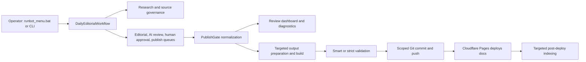
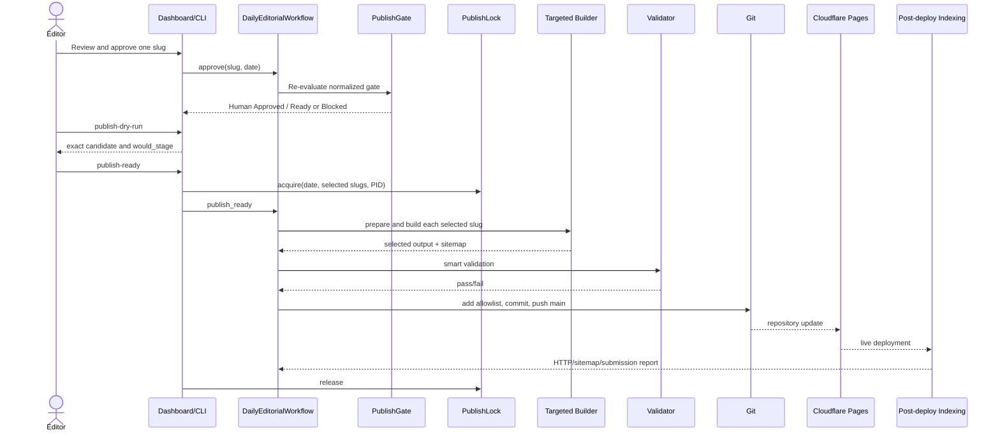
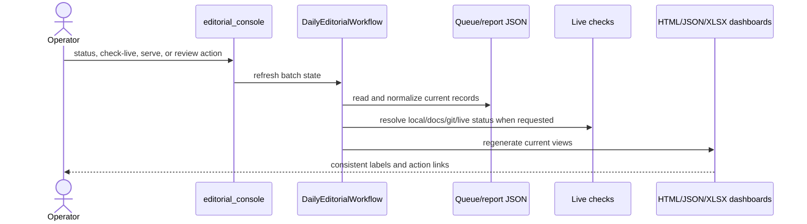
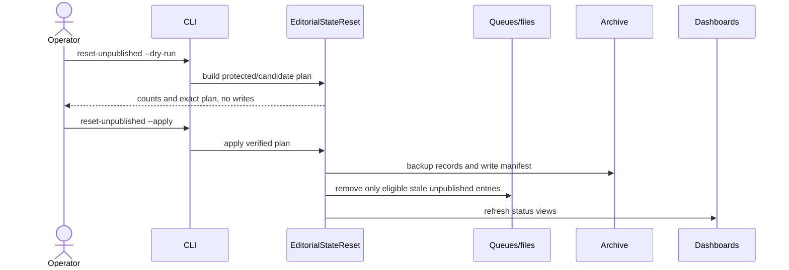

# Smile AI Review Hub Project Guide

This document is the operator and developer guide for the implementation currently in this repository. It describes observed behavior, not a proposed redesign.

## Executive overview

Smile AI Review Hub is a Windows-operated Python editorial system and static affiliate site for `https://smileaireviewhub.com/`. The active workflow discovers topics, builds research packages and drafts, runs AI and source checks, waits for human approval, normalizes the publish gate, builds selected static output, validates it, commits a tightly scoped file set, and relies on Cloudflare Pages Git integration for deployment. Post-deploy indexing runs from GitHub Actions.

Production publication is deliberately gated:

```text
AI Review -> Human Approval -> Publish Validation -> Ready for Publish -> Published -> Live 200
```

`Human Approved` is an editorial decision. `Publish Blocked` is a validation result. They are separate dimensions and can coexist until blockers are resolved.

## Architecture overview



The five ownership boundaries are defined in `architecture/FIVE_MODULE_BOUNDARIES.md`. SEO opportunity research is intentionally isolated from publication; see `architecture/SEO_ENGINE_BOUNDARY.md`.

## Project structure

| Path | Current purpose |
|---|---|
| `editorial_console.py` | Primary editorial CLI and interactive-dashboard launcher. |
| `runbot_menu.bat` | Windows operator menu 1-13. |
| `runbot_*.bat` | Week-start, Tue-Sun, custom-topic, and partner-intake wrappers. |
| `seo_console.py` | Offline SEO Engine CLI. |
| `build_site.py` | Full static-site builder; not used for a normal targeted article build. |
| `modules/` | Domain modules and orchestration support. |
| `modules/seo_engine/` | Offline keyword, cluster, gap, link, intent, and opportunity analysis. |
| `scripts/` | Build, validation, report, deploy, indexing, import, and maintenance entry points. |
| `config/` | Runtime configuration and thresholds. |
| `data/` | Queues, source registries, research, drafts, reports, locks, history, and archives. |
| `data/editorial_queue/<date>/` | Batch topic source and per-batch state. |
| `data/production_article_drafts/<slug>/` | Draft HTML, Markdown, metadata, and readiness artifacts. |
| `data/published_static_pages/<slug>/` | Prepared/published static article copy. |
| `data/archive/unpublished_reset/<timestamp>/` | Reset backups and manifests. |
| `upload/<date>/` | Generated operator dashboard, review bundles, and selected publish copies. |
| `site_output/` | Built static-site output and local sitemap mirror. |
| `docs/` | Cloudflare production publish root tracked by Git. |
| `assets/` | Source visual and site assets. |
| `social_drafts/`, `social_assets/`, `video_output/` | Generated manual distribution assets; no automatic social/video publishing. |
| `dashboard/`, `reports/`, `logs/` | Generated operational views, reports, and execution/indexing logs. |
| `.github/workflows/` | Health checks and post-deploy indexing automation. |
| `tests/` | Unit, integration, gate, dashboard, indexing, and safety regression tests. |
| `architecture/` | Current architecture reference set. |
| `src/`, `main.py`, `runbot.bat` | Earlier affiliate research bot retained alongside the editorial system. |

There are legacy/compatibility directories such as `draft-output`, `draft_output`, `landing_pages`, `netlify`, `temp`, and `tmp`. Their presence does not make them authoritative for the current publish flow.

## Module responsibilities

- `modules/daily_editorial_workflow.py`: main application service for batches, drafts, approval, dashboard generation, diagnostics, targeted publish, live status, and reset integration.
- `modules/publish_gate.py`: evaluates and normalizes gate state; separates active blockers, warnings, pending reviews, historical warnings, and final state.
- `modules/human_approval.py`, `modules/content_review.py`, `modules/source_review.py`: human, AI/content, and source review records.
- `modules/research_intelligence.py`, `modules/verified_source_acquisition.py`, `modules/knowledge_registry.py`: research package, verified sources, trust, and freshness.
- `modules/review_dashboard_server.py`: local HTTP server and approve/reject action boundary.
- `modules/publish_lock.py`: single-process publish lock with PID and stale-lock safeguards.
- `modules/editorial_state_reset.py`: dry-run-first archival reset for stale unpublished records.
- `scripts/build_selected_output.py`: bounded selected-slug build and sitemap refresh.
- `scripts/validate_publishing_batch.py`, `scripts/post_deploy_indexing.py`: pre-publish and post-deploy validation/submission.
- `scripts/build_ceo_dashboard.py`: consolidated dashboard/report builder.
- `modules/sitemap_generator.py`, `modules/indexing_policy.py`: public URL inclusion and sitemap generation.

## Menu 1-13

| Menu | Current behavior |
|---|---|
| 1 | Runs week-start generation for 10 weekly topics and drafts. |
| 2 | Runs advanced Tue-Sun follow-up draft generation. |
| 3 | Opens custom-topic intake. |
| 4 | Starts/reuses the local review server on port 8765 and opens the dashboard. |
| 5 | Refreshes and prints compact batch status. |
| 6 | Builds/opens the all-article live status report. |
| 7 | Builds/opens the blocked-only live report. |
| 8 | Resolves exact Ready for Publish candidates, smart-validates, publishes, commits, pushes, then opens live status. A no-ready batch returns safely. |
| 9 | Runs affiliate partner intake and content-cluster preparation. |
| 10 | Exits. |
| 11 | Runs strict full-site validation for a selected date. |
| 12 | Opens the offline SEO Engine submenu. Queue actions are dry-run only. |
| 13 | Previews or applies stale-unpublished archival reset. |

## Daily operator workflow

1. Run menu 1 at week start or menu 2 on Tue-Sun.
2. Open menu 4 and inspect the draft, AI report, source review, hard blockers, warnings, and pending reviews.
3. Approve only after human review. Approval does not bypass source, freshness, AI, image, schema, canonical, or output checks.
4. Use menu 5 or `diagnose-article` to confirm `Ready for Publish` and no hard blockers.
5. Run `publish-dry-run` for the exact slug and inspect `would_stage`.
6. Use menu 8 only when the selected set is intentional. The process acquires the publish lock, performs a bounded build, validates, stages allowlisted paths, commits, and pushes.
7. Use menu 6 to confirm `Published` and `Live 200`; inspect the indexing report after deployment.

## Approval and publish workflow



Dry-run accepts only a final normalized state of exactly `Ready for Publish`. It performs no build, output write, queue mutation, Git action, approval, deployment, or indexing submission. Real publishing rejects unrelated or whole `upload/<date>` paths through an explicit stage-scope assertion.

## Dashboard generation flow



The dashboard is generated output. Use menu 4/5 or CLI refresh commands rather than editing HTML. Published rows use `Published` as final state; legacy warnings remain only in audit/history fields, not active blockers.

## Queue lifecycle

See `architecture/QUEUE_ARCHITECTURE.md`. In summary: discovery writes the dated topic queue; research/source/AI review enrich it; human review records a decision; publish gate writes normalized state; selected publication records local/published/live history. Queue JSON is source data owned by the workflow, not an operator editing surface.

## SEO Engine workflow

Menu 12 imports keyword signals, builds clusters, analyzes gaps, plans internal links, scores opportunities, and writes offline reports. `queue-opportunity` and `queue-top` are preview/dry-run boundaries and do not approve or publish editorial articles. See `architecture/SEO_ENGINE_BOUNDARY.md`.

## Reset stale unpublished



Published/live records, current active batch data, selected SEO work, docs/site output, published static pages, sitemap, and live history are protected. Apply archives first; it does not silently delete protected content.

## Locking and timeout strategy

- `data/publish.lock` records PID, start time, date, slugs, and command.
- An active lock blocks another publish. It is released in a `finally` path.
- A stale lock is not automatically cleared; use `publish-lock-status`, then `clear-stale-publish-lock --confirm` after PID verification.
- Targeted build timeout defaults to 180 seconds and permits at most one retry.
- General subprocess timeout defaults to 600 seconds. Timeout errors include the stderr tail.
- The CLI prints periodic progress for long publish operations.

## Build, validation, deployment, and indexing

Targeted publishing copies the selected draft HTML to `data/published_static_pages`, `site_output`, `docs`, and `upload/<date>/published`, then runs `scripts/build_selected_output.py` for bounded asset/sitemap work. Full `build_site.py` is reserved for full-site maintenance.

Smart validation scopes checks to selected publish candidates. Strict mode validates the complete `site_output` and `docs` trees and remains capable of reporting historical defects. Checks include gate state, local/docs output, image, canonical, structured data, sitemap, language/content integrity, and link/page requirements implemented by the validators.

Cloudflare Pages deploys the tracked `docs/` tree after push to `main`. `.github/workflows/post-deploy-indexing.yml` derives changed URLs and invokes `targeted_publish_preflight`; unrelated historical `/review/` defects do not block that selected set. `strict_full_site_audit` remains available for whole-site auditing. IndexNow is submitted when configured; Google/Bing Webmaster results explicitly use `skipped_credentials_missing` when secrets are absent. Non-strict indexing records failure without rolling back a successful deploy. `netlify.toml` is compatibility/legacy configuration and is not the active production deployment path.

## Generated outputs and manual-edit policy

Never edit these by hand:

- queue and state files under `data/`, especially `publish_queue.json`, `human_approval_queue.json`, review queues, live history, and `publish.lock`;
- `data/production_article_drafts/<slug>/index.html` after workflow generation unless using an approved source/template change;
- `data/published_static_pages/`, `site_output/`, `docs/`, and `upload/` generated article/dashboard copies;
- generated sitemap, dashboard HTML/JSON/XLSX, validation reports, indexing reports, social drafts, and video output;
- archive manifests or history JSONL files.

Edit source modules, templates/configuration, or curated input registries, then regenerate through the owning command. Never hand-edit article state to force a gate pass.

## Developer workflow

1. Read this guide and the relevant boundary document.
2. Inspect `git status` because generated output may already be dirty.
3. Make a narrowly scoped source/test/documentation change.
4. Run targeted tests, then `python -m pytest` for runtime changes.
5. Use diagnostics and dry-run before any publish-path test.
6. Stage explicit paths and inspect `git diff --cached --name-only`.
7. Never publish a real article as a side effect of testing.

## Safe maintenance procedures

- Use `validate-batch --mode smart` for selected daily work and menu 11 for deliberate full-site audit.
- Use `reset-unpublished --dry-run` before `--apply`.
- Use `recover-interrupted-preparation` only with `--confirm` and only when its safeguards match.
- Do not clear a lock until the recorded PID is confirmed inactive.
- Do not run full-site regeneration during a one-article publish unless a reproducible dependency requires it.
- Keep editorial status, deployment status, and historical diagnostics separate.

## Troubleshooting

- Approval appears silent: keep the local `serve` terminal open, check the URL `message` parameter, refresh menu 5, and run `diagnose-article`. Approval may succeed while the publish gate remains blocked.
- No article ready: this is an operational state. Open menu 4 for gate reasons; menu 8 returns to the menu without committing or pushing.
- Lock blocks publish: run `publish-lock-status`; clear only a verified stale lock with `--confirm`.
- Targeted build times out: inspect its stderr tail, fix the selected bundle, and retry once; do not start a full build automatically.
- `Missing Local Output` or `Docs Pending`: run `build-selected` only for an exact Ready for Publish slug.
- Live page is absent after push: use `check-live --all`, then inspect Cloudflare deployment and indexing logs. Indexing failure does not undo deployment.
- Strict audit reports `/review/` history: fix it as separate full-site maintenance; targeted publish preflight intentionally ignores unrelated URLs.

## Common commands

```powershell
python editorial_console.py status --date YYYY-MM-DD --json
python editorial_console.py diagnose-article --date YYYY-MM-DD --slug SLUG
python editorial_console.py diagnose-batch --date YYYY-MM-DD
python editorial_console.py publish-dry-run --date YYYY-MM-DD --slug SLUG
python editorial_console.py build-selected --date YYYY-MM-DD --slug SLUG --timeout 180
python editorial_console.py validate-batch --date YYYY-MM-DD --mode smart
python editorial_console.py validate-batch --date YYYY-MM-DD --mode strict
python editorial_console.py check-live --all --open
python editorial_console.py publish-lock-status
python editorial_console.py reset-unpublished --dry-run
python editorial_console.py reset-unpublished --apply
python scripts/post_deploy_indexing.py --preflight-mode targeted_publish_preflight --urls-file data/published_today.json
python -m pytest
```

## Current limitations and technical debt

- The repository contains substantial tracked/generated output, so a full build can produce a very large dirty worktree.
- Queue/state data is shared JSON rather than a transactional database; the publish lock protects publish execution, not every writer.
- Dashboard refresh combines several report sources and can expose stale data until regeneration.
- Cloudflare deployment completion is external and eventually consistent.
- Search submissions depend on credentials and provider availability; missing credentials are expected skips.
- Historical `/review/` and legacy generated URLs can still fail strict full-site audit.
- Both old affiliate-bot entry points and the newer editorial platform remain in one repository.
- Netlify compatibility configuration remains although Cloudflare is active.

## Safe extension points

- Add a validator behind the existing smart/strict interfaces.
- Add dashboard fields from normalized status, keeping active and historical diagnostics separate.
- Add an SEO analyzer inside `modules/seo_engine/` without writing approval/publish queues.
- Add a deployment/indexing provider behind existing report contracts and non-strict semantics.
- Add queue adapters that preserve current JSON schemas and audit history.
- Add targeted asset builders that accept an explicit slug and pass stage-scope checks.

## Future roadmap placeholder

No future architecture is committed in this document. Proposed work must begin with a separate design/checkpoint and preserve the current boundaries until approved.
