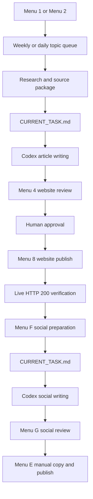
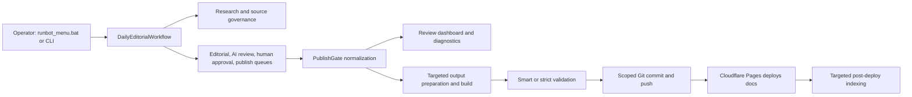
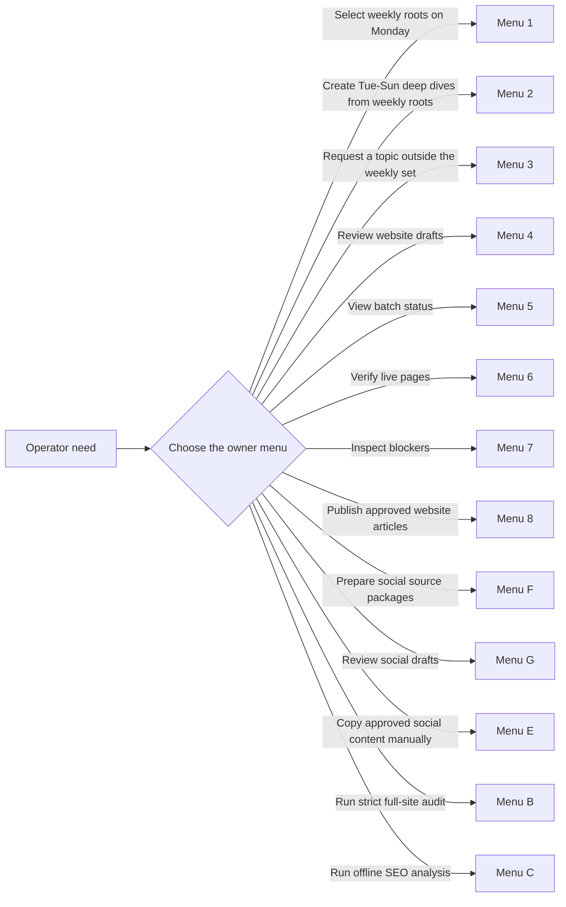
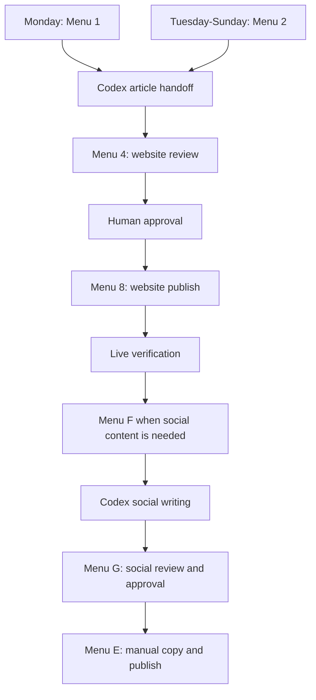
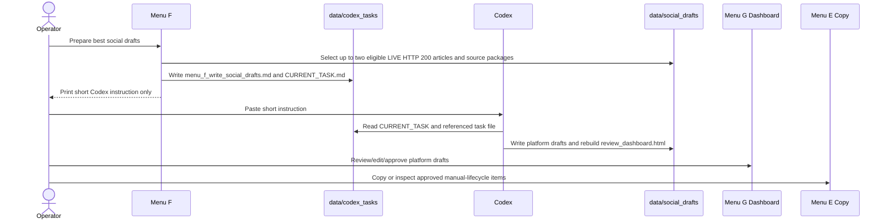
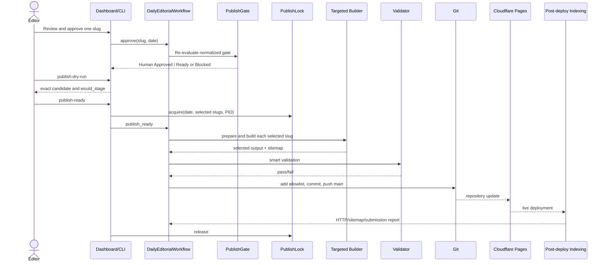
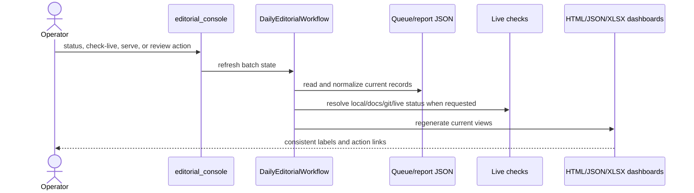
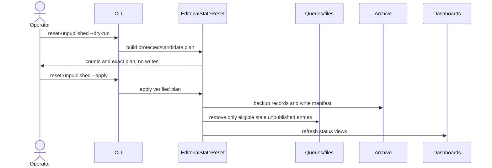

# Smile AI Review Hub Project Guide

This document is the operator and developer guide for the implementation currently in this repository. It describes observed behavior, not a proposed redesign.

Last synchronized with the repository: **2026-07-18**.

## Executive overview

Smile AI Review Hub is a Windows-operated Python editorial system and static affiliate site for `https://smileaireviewhub.com/`. The active workflow discovers topics, builds research packages and drafts, runs AI and source checks, waits for human approval, normalizes the publish gate, builds selected static output, validates it, commits a tightly scoped file set, and relies on Cloudflare Pages Git integration for deployment. Post-deploy indexing runs from GitHub Actions.

Article writing and social-copy writing currently use repository-local Codex handoffs. Menu 1, Menu 2, and Menu F prepare queues, research/source packages, and durable instruction files; they do not call OpenAI, `gpt-4o-mini`, a Codex API, or a heuristic writer. Codex reads those files in the shared repository and writes drafts into the workflow-owned storage. Publication remains a separate human-approved operation.

## Design philosophy

- **Lowest practical operating cost:** prefer repository-local processing, standard Python tooling, available no-cost data, and manual editorial operations.
- **No paid API dependency by default:** the active Codex writing handoffs and manual social workflow do not require paid AI or social APIs. External HTTP checks, GitHub, Cloudflare Pages, and indexing providers are still part of the wider operating environment.
- **Human editorial control:** an editor reviews drafts and must explicitly approve an article before it can become eligible for publication.
- **Local-first execution:** queue preparation, writing handoffs, draft storage, dashboards, validation, and manual social-copy review run from the local repository.
- **Repository-first architecture:** files, source modules, tests, manifests, and history inside the repository are the integration surface between operator commands and Codex.
- **Website first, social second:** the validated live website article is the source of truth. Social drafts are downstream adaptations, not independent factual sources.
- **Deterministic and recoverable workflows:** prefer explicit task files, dated queues, normalized states, allowlisted staging, dry-runs, locks, and archived history. Some shared JSON writers and external deployment steps are not fully transactional, so operators must still inspect failures.
- **Cost-aware scaling:** scale through reusable weekly topic clusters, daily angles, targeted builds, and manual approval rather than forcing recurring API cost.

## Golden rules

1. The live website article is the factual source of truth for downstream social content.
2. Social preparation follows a validated LIVE HTTP 200 article; it never precedes website publication.
3. Never publish a website article without explicit human approval and a passing normalized publish gate.
4. Codex writes requested draft files and reports its work; it does not decide approval, publication, deployment, or indexing state.
5. Workflow code owns queues, manifests, validation, metadata, and state transitions; the operator owns approve/reject and publish decisions.
6. Never force queue, approval, or publish state by editing generated JSON or reports.
7. Do not use paid APIs by default; a future exception requires an explicit approved design.
8. Social publication remains manual and is never automatically marked complete.
9. Prefer deterministic repository evidence, repeatable owner commands, and recoverable failure handling over AI guessing.
10. Commit only scoped, reviewed, intentional files.

Production publication is deliberately gated:

```text
AI Review -> Human Approval -> Publish Validation -> Ready for Publish -> Published -> Live 200
```

`Human Approved` is an editorial decision. `Publish Blocked` is a validation result. They are separate dimensions and can coexist until blockers are resolved.

## Documentation authority

This guide documents behavior observed in the current repository. When documentation conflicts with implementation, use source code, tests, architecture boundary documents, and real runtime output as evidence, then correct the guide. Do not document proposed features as if they already exist. Update the synchronized date only after verifying the relevant repository behavior.

## Ownership and authority

| Owner | Current authority and responsibility |
|---|---|
| Operator | Confirms weekly/custom topics, performs human review, decides approve/reject, initiates website publication, manually publishes social content, and confirms the real final social URL. |
| Codex | Reads `CURRENT_TASK.md` and its referenced task, writes website or social drafts only to workflow-owned repository locations, validates the requested writing output, and reports exactly what changed. Codex must not edit queue/state data to force a pass. |
| Workflow code | Creates queues and research packages; owns manifests, generated metadata, validation, publish-gate evaluation, state transitions, dashboard regeneration, and manual-publish history. |
| Git and GitHub | Preserve reviewed repository history and carry only the scoped commit/push selected by the publish or maintenance task. |
| Cloudflare Pages | Deploys the tracked `docs/` output after the relevant commit reaches the configured Git branch. |
| Indexing workflow | Performs post-deploy preflight/submission where configured and writes indexing reports; it does not approve or publish articles. |

Source code and tests are the primary implementation authority when wording in this guide becomes stale. Runtime manifests and reports provide evidence of a particular execution, but generated display text does not override normalized workflow state.

## System at a glance



Website publication always precedes social preparation. Codex writes drafts at the two handoff steps; it does not approve or publish. Menu F selects live source articles and prepares packages, while Menu G and Menu E preserve human review and manual publication.

## Architecture overview



The five ownership boundaries are defined in `architecture/FIVE_MODULE_BOUNDARIES.md`. SEO opportunity research is intentionally isolated from publication; see `architecture/SEO_ENGINE_BOUNDARY.md`.

The repository also contains a read-only multi-site foundation documented in `architecture/MULTI_SITE_AFFILIATE_ENGINE.md`. It provides validated site profiles, a fail-closed affiliate catalog/resolver, and an immutable compatibility adapter. `config.py` remains authoritative; only `modules/site_builder.py::page_shell` resolves its displayed `site_name` through the adapter, with byte-equivalent regression coverage. Queues, canonical, sitemap, publication, deployment, and indexing remain on the existing Smile AI paths.

## Project structure

| Path | Current purpose |
|---|---|
| `editorial_console.py` | Primary editorial CLI and interactive-dashboard launcher. |
| `runbot_menu.bat` | Windows operator menu; items 10-16 use keys A-G and also accept numeric aliases 10-16. |
| `runbot_*.bat` | Week-start, Tue-Sun, custom-topic, and partner-intake wrappers. |
| `seo_console.py` | Offline SEO Engine CLI. |
| `build_site.py` | Full static-site builder; not used for a normal targeted article build. |
| `modules/` | Domain modules and orchestration support. |
| `modules/seo_engine/` | Offline keyword, cluster, gap, link, intent, and opportunity analysis. |
| `scripts/` | Build, validation, report, deploy, indexing, import, and maintenance entry points. |
| `config/` | Runtime configuration and thresholds. |
| `config/sites/` | Validated JSON site profiles. `smile_ai_review_hub` is the active default; Health and Sports are inactive examples. |
| `data/` | Queues, source registries, research, drafts, reports, locks, history, and archives. |
| `data/sites/<site_id>/affiliate/` | New per-site partner/product/link contract. The default catalog is empty until operator-owned links are verified. |
| `data/editorial_queue/<date>/` | Batch topic source and per-batch state. |
| `data/production_article_drafts/<slug>/` | Draft HTML, Markdown, metadata, and readiness artifacts. |
| `data/published_static_pages/<slug>/` | Prepared/published static article copy. |
| `data/archive/unpublished_reset/<timestamp>/` | Reset backups and manifests. |
| `upload/<date>/` | Generated operator dashboard, review bundles, and selected publish copies. |
| `site_output/` | Built static-site output and local sitemap mirror. |
| `docs/` | Cloudflare production publish root tracked by Git. |
| `assets/` | Source visual and site assets. |
| `data/codex_tasks/` | Generated Codex handoff instructions. `CURRENT_TASK.md` points to the latest prepared writing task. |
| `data/social_drafts/<date>/` | Manual social writing packages, platform drafts, review dashboard, image assets, and approval metadata. |
| `data/social_drafts/<date>/ranking.json` | Ranked LIVE HTTP 200 candidates and the eligible articles selected by Menu F, normally up to two. |
| `data/social_drafts/<date>/<slug>/source_package.json` | Website content, canonical URL, image, key points, and platform requirements supplied to Codex. |
| `data/social_drafts/<date>/<slug>/<platform>/` | Platform variants `A.md`, `B.md`, `C.md`, `metadata.json`, and structured output where applicable. |
| `social_drafts/`, `social_assets/`, `video_output/` | Legacy or generated manual distribution assets; no automatic social/video publishing. |
| `dashboard/`, `reports/`, `logs/` | Generated operational views, reports, and execution/indexing logs. |
| `.github/workflows/` | Health checks and post-deploy indexing automation. |
| `tests/` | Unit, integration, gate, dashboard, indexing, and safety regression tests. |
| `architecture/` | Current architecture reference set. |
| `src/`, `main.py`, `runbot.bat` | Earlier affiliate research bot retained alongside the editorial system. |

There are legacy/compatibility directories such as `draft-output`, `draft_output`, `landing_pages`, `netlify`, `temp`, and `tmp`. Their presence does not make them authoritative for the current publish flow.

## Module responsibilities

- `modules/daily_editorial_workflow.py`: main application service for batches, drafts, approval, dashboard generation, diagnostics, targeted publish, live status, and reset integration.
- `modules/publish_gate.py`: evaluates and normalizes gate state; separates active blockers, warnings, pending reviews, historical warnings, and final state.
- `modules/human_approval.py`, `modules/content_review.py`, `modules/source_review.py`: human, AI/content, and source review records.
- `modules/research_intelligence.py`, `modules/verified_source_acquisition.py`, `modules/knowledge_registry.py`: research package, verified sources, trust, and freshness.
- `modules/review_dashboard_server.py`: local HTTP server and approve/reject action boundary.
- `modules/social/draft_workflow.py`: selects live articles, creates social source packages/assets, validates platform drafts, renders the social dashboard, and owns social review/manual-publish states.
- `modules/social/review_dashboard_server.py`: detached local social dashboard server, health check, local image serving, review actions, and scoped shutdown.
- `modules/social/publisher_manager.py`: `social_console.py` command implementation for preparation, review, copy, manual status, and platform adapters.
- `scripts/codex_instruction_prompt.py`: writes stable Menu 1, Menu 2, and Menu F Codex handoff files and updates `CURRENT_TASK.md`.
- `scripts/codex_write_daily_articles.py`: repository-local article-writing entry point retained for direct controlled runs; it does not publish.
- `modules/publish_lock.py`: single-process publish lock with PID and stale-lock safeguards.
- `modules/editorial_state_reset.py`: dry-run-first archival reset for stale unpublished records.
- `scripts/build_selected_output.py`: bounded selected-slug build and sitemap refresh.
- `scripts/validate_publishing_batch.py`, `scripts/post_deploy_indexing.py`: pre-publish and post-deploy validation/submission.
- `scripts/build_ceo_dashboard.py`: consolidated dashboard/report builder.
- `modules/sitemap_generator.py`, `modules/indexing_policy.py`: public URL inclusion and sitemap generation.
- `modules/platform/site_profile.py`: read-only site-profile loading, validation, active/default selection, and production safety checks.
- `modules/platform/affiliate_data.py`, `modules/platform/affiliate_resolver.py`: validated per-site affiliate catalog and fail-closed link resolution; not yet connected to production CTA rendering.
- `modules/platform/site_runtime_config.py`: frozen legacy-authority compatibility context; profile mismatch falls back in normal mode and fails closed in strict mode.

## Menu 1-16

In `runbot_menu.bat`, items 10-16 are selected with `A-G` or numeric aliases: `A` exits, `B` runs strict audit, `C` opens SEO Engine, `D` opens reset stale unpublished, `E` opens the social publisher, `F` prepares the best social drafts, and `G` opens the social review dashboard. The main menu uses a typed prompt so numeric aliases and letters both work.

| Menu | Current behavior |
|---|---|
| 1 | Previews and confirms up to 10 Monday root topics, stores the weekly root set, prepares research, writes a Codex handoff task under `data/codex_tasks/<date>/menu_1_write_new_articles.md`, and updates `data/codex_tasks/CURRENT_TASK.md`. It does not open the dashboard; Codex writes drafts afterward. |
| 2 | Reads the current week's root set, creates at most one new Tue-Sun angle per active root topic, prepares angle-specific research, writes `data/codex_tasks/<date>/menu_2_write_deep_dive_articles.md`, and updates `CURRENT_TASK.md`. It never runs trend discovery or opens the dashboard. |
| 3 | Opens custom-topic intake. |
| 4 | Resolves the latest batch that actually contains drafts, starts/reuses the local review server on port 8765, and opens only that batch. A queue-only batch does not cause an old dashboard to be reused. |
| 5 | Refreshes and prints compact batch status. |
| 6 | Builds/opens the all-article live status report. |
| 7 | Builds/opens the blocked-only live report. |
| 8 | Resolves exact Ready for Publish candidates, smart-validates, publishes, commits, pushes, then opens live status. A no-ready batch returns safely. |
| 9 | Runs affiliate partner intake and content-cluster preparation. |
| 10 | Exits. |
| 11 | Runs strict full-site validation for a selected date. |
| 12 | Opens the offline SEO Engine submenu. Queue actions are dry-run only. |
| 13 | Previews or applies stale-unpublished archival reset. |
| 14 | Opens the Social Publisher submenu. It only shows drafts already approved for manual copy and never auto-publishes. |
| 15 | Prepares social writing packages for up to two highest-ranked eligible LIVE HTTP 200 articles, writes `data/codex_tasks/<date>/menu_f_write_social_drafts.md`, updates `CURRENT_TASK.md`, and prints the short Codex handoff instruction. |
| 16 | Starts or reuses the local social review dashboard server on port 8776 in a separate Windows process, opens the manual review UI, and immediately returns the original Runbot window to the menu. |

## Operator decision guide



Menu E, Menu F, and Menu G do not auto-publish. Use Menu 3 rather than changing the active weekly root set when a separate custom topic is intentionally required.

## Daily operating flow



Menu 1, Menu 2, and Menu F prepare handoff files and the repository data required for the next writing step. They do not themselves create final Codex-written copy, approve it, or publish it. Codex reads the referenced task file and writes directly into workflow-owned repository storage.

Menu 8 is the website publication path. It operates only on articles that pass the existing human-approval and publish-gate rules. Social publication remains manual: Menu G reviews and approves social copy, while Menu E excludes unapproved review states and exposes approved items plus their downstream manual-publish states.

## Article and social lifecycle

Website processing uses separate state dimensions rather than one interchangeable label:

```text
QUEUE_CREATED
-> WRITING
-> DRAFT_READY
-> UNDER_REVIEW
-> HUMAN_APPROVED
-> READY_FOR_PUBLISH
-> PUBLISHED
```

- **Batch state:** the uppercase values above describe the batch's workflow progression. Topic selection and research preparation remain within `QUEUE_CREATED` until writing/draft evidence advances the batch.
- **Editorial state:** describes draft and human-review progress. Human approval records an editor decision but does not erase validation blockers.
- **Publish-gate state:** may display `Human Approval Required`, `Publish Blocked`, `Ready for Publish`, or `Published` according to normalized evidence. `Publish Blocked` is a validation outcome, not an opposite editorial decision to `Human Approved`.
- **Deployment state:** is tracked independently through output/Git/live conditions such as `Not Generated`, `Awaiting Publish`, `Awaiting Push`, and `Live 200`.

Operationally, an article moves from selected topic and prepared research to a Codex-written draft, AI/source review, explicit human approval, gate evaluation, `Ready for Publish`, publication, and finally live HTTP verification. Only the workflow may record these transitions.

The manual social lifecycle begins only after a live website article exists:

```text
Live website article
-> social package prepared
-> needs_social_review
-> approved_for_copy | revision_requested | rejected | not_recommended
-> pending_manual_publish
-> published_manual
```

The branches after `needs_social_review` are human review outcomes. Only `approved_for_copy` can continue to manual publication. `published_manual` requires confirmation of a real final platform URL.

## 30-second operating summary

```text
Monday:          Menu 1 -> Codex -> Menu 4 -> Menu 8
Tuesday-Sunday:  Menu 2 -> Codex -> Menu 4 -> Menu 8
After Live 200:  Menu F -> Codex -> Menu G -> Menu E
```

Use this handoff after Menu 1, Menu 2, or Menu F:

```text
Open data/codex_tasks/CURRENT_TASK.md, follow the referenced instruction file exactly, inspect the repository, and complete the writing task. Do not approve, publish, commit, push, deploy, or use paid APIs.
```

## Daily operator workflow

1. Run menu 1 on Monday to select and persist the weekly root-topic set in `data/editorial_queue/weeks/<week_start>/week.json`.
2. On Tuesday-Sunday, run menu 2. It reuses only the active weekly roots and applies the daily implementation, comparison, pricing, use-case, troubleshooting, or buying-decision profile. A missing weekly set stops safely. If Monday stored 7 roots, Menu 2 may produce at most 7 daily angles and cannot introduce an eighth topic from discovery or another weekly set.
3. After menu 1 or menu 2 completes, copy the short Codex instruction shown in the 30-second operating summary. Codex then reads `CURRENT_TASK.md`, follows the referenced task file, writes drafts directly into the existing repository data stores, and updates the dashboard-readable queues. The handoff file is complete and machine-readable; the console must not print a long prompt, use the clipboard, launch Codex, call OpenAI, call `gpt-4o-mini`, use heuristic fallback, open GitHub, deploy, or index.
4. Open menu 4 and inspect the draft, AI report, source review, hard blockers, warnings, and pending reviews.
5. Approve only after human review. Approval does not bypass source, freshness, AI, image, schema, canonical, or output checks.
6. Use menu 5 or `diagnose-article` to confirm `Ready for Publish` and no hard blockers.
7. Run `publish-dry-run` for the exact slug and inspect `would_stage`.
8. Use menu 8 only when the selected set is intentional. The process acquires the publish lock, performs a bounded build, validates, stages allowlisted paths, commits, and pushes.
9. Use menu 6 to confirm `Published` and `Live 200`; inspect the indexing report after deployment.

## Content strategy model

```text
weekly root topics
-> topic clusters
-> daily deep-dive angles
-> website articles
-> internal linking
-> social distribution
-> topical authority
-> evergreen updates
```

Menu 1 targets up to 10 source-ready weekly root topics. Ten is a ceiling and target, not permission to invent weak topics. The persisted weekly manifest is authoritative for that week.

Menu 2 creates daily deep-dive angles only from roots in that manifest:

- it does not run trend discovery;
- it accepts only roots whose status is `active` or `weekly_selected`;
- it preserves `root_topic_id`, records `daily_angle`, and includes prior weekly article history;
- it creates at most one angle per eligible root for the dated queue;
- it holds a root when its daily angle lacks source readiness or collides with an angle already used that week;
- it does not replace a held root with an unrelated topic;
- rerunning Menu 2 for an existing valid dated queue reuses that queue rather than selecting new topics.

Therefore, if Menu 1 stores 7 weekly roots on Monday, every Tuesday-Sunday batch for that week is constrained to those same 7 identities. A daily batch may contain fewer than 7 if a root is inactive, lacks adequate sources for that angle, or would duplicate existing weekly coverage. It must never expand beyond those 7 by importing another topic.

Website articles form the factual and linking center of the strategy. Internal links should connect relevant cluster articles without changing canonical identity. Social copy must point back to the matching live website article. Content-strategy metadata supports selection, linking, and reporting; it cannot approve or publish content.

## Codex handoff task files

`scripts/codex_instruction_prompt.py` owns the operator-to-Codex handoff files. It writes a stable Markdown task file and updates `data/codex_tasks/CURRENT_TASK.md` only after the task file is successfully created.

Current generated task types:

- Menu 1: `data/codex_tasks/<date>/menu_1_write_new_articles.md`
- Menu 2: `data/codex_tasks/<date>/menu_2_write_deep_dive_articles.md`
- Menu F: `data/codex_tasks/<date>/menu_f_write_social_drafts.md`

Each task file must include: task identity, objective, real date/batch information, input files to inspect, source/research files, selected topics or articles, required output paths, writing requirements, state requirements, validation checks, prohibited actions, and final report requirements. `CURRENT_TASK.md` contains only the active pointer and the short instruction to paste into Codex.

The handoff never uses clipboard automation, browser automation, OpenAI/GPT/Codex APIs, paid APIs, Git commit/push, deployment, indexing, social APIs, or OAuth. Codex is expected to inspect the repository and write files directly under the existing workflow-owned locations.

## Manual social workflow



Menu F ranks already-live website articles and selects up to the requested count, which Menu F currently sets to two. It prepares source packages and Codex instructions; it does not create final social copy through fixed templates and does not publish. Codex writes the platform-specific drafts after reading the live article/source package.

Menu G is the only social review surface. It previews full content, images, URL, CTA, hashtags/tags, platform metadata, and reviewer notes. Approval changes only social draft copy status. It does not publish to any social network.

Menu E excludes `needs_social_review`, revision, rejected, and not-recommended drafts. Its approved-item listing includes `approved_for_copy` and the downstream `pending_manual_publish` and `published_manual` states so the operator can continue or inspect manual publication. It copies UTF-8 content and records `published_manual` only after an explicit operator confirmation with the final published URL. It never auto-publishes, never uses social APIs, and never marks an item published automatically.

When writing Vietnamese social copy, store and render UTF-8 text directly. Replacement question marks, malformed diacritics, or Unicode replacement characters indicate corrupted draft data and must be fixed in the draft Markdown and `metadata.json`, then `social_console.py review-dashboard --date <date>` should be run to rebuild the dashboard.

### Social platforms and draft contract

The current social review set contains 14 platform targets:

```text
Facebook English, Facebook Vietnamese, LinkedIn, X, Quora, Dev.to,
Pinterest, Product Hunt, Threads, Bluesky, Medium, Hashnode, Blogger,
and Telegram
```

For each selected article and platform, the writing contract is:

- `A.md`, `B.md`, and `C.md`: distinct reviewable copy variants;
- `metadata.json`: full title, body, CTA, hashtags/tags, complete live website URL, image fields, selected version, validation warnings, reviewer notes, and status;
- `assets/<platform>.png`: local upload-ready image generated or reused by the workflow when supported;
- UTF-8 storage and rendering with no truncated title, body, URL, or multibyte Vietnamese text.

The normal state progression is:

```text
needs_social_review
-> approved_for_copy | revision_requested | rejected | not_recommended
-> pending_manual_publish
-> published_manual
```

Only a human action in Menu G can move a draft to `approved_for_copy`. Menu E cannot see `needs_social_review` drafts. `published_manual` requires an explicit confirmation and final platform URL; copying content does not mark it published.

### Platform-specific output

- Facebook English and Vietnamese use natural short paragraphs, a CTA, the full website URL, and relevant hashtags. Vietnamese source Markdown and metadata must remain valid UTF-8.
- LinkedIn uses professional insight and a complete URL. Its link-preview image is controlled by the website's live Open Graph metadata; the local PNG remains available for manual upload.
- X is clipped to the configured character limit and keeps a complete clickable URL plus minimal hashtags.
- Quora copy contains only the public answer text. Internal drafting labels such as `Suggested question: Quora answer draft` and `# Quora answer draft` must never appear in Copy All output.
- Dev.to uses clean Markdown and structured metadata. A canonical URL belongs in Dev.to's canonical/front-matter field; the literal internal label `Canonical URL note:` must not be pasted into the public article.
- Pinterest exposes pin title, description, destination URL, suggested board, keywords, alt text, and a portrait local image. Manual publication status is tracked separately.
- Blogger creates a companion article rather than a duplicate repost. Its structured output includes `A.md`, `article.html`, `metadata.json`, `plain_text_body`, `html_body`, labels, slug, search description, JSON-LD, image metadata, SEO metrics, and validation results.
- Bluesky contains a standalone post and a short thread; each post is validated against the configured character limit instead of copying article paragraphs.
- Medium, Hashnode, Threads, Product Hunt, and Telegram use platform-adapted copy while preserving the complete live source URL and avoiding internal workflow labels.

The dashboard's Copy All renderer produces paste-ready public copy. It removes internal headings/debug labels, preserves the full URL, includes hashtags where the platform uses them, and avoids duplicating CTA, disclosure, source link, or canonical text. A URL pasted as plain text remains clickable on platforms that auto-link HTTP URLs; local image files must still be uploaded manually when the platform does not generate a usable Open Graph preview.

### Social dashboard server lifecycle

Menu G launches `social_console.py launch-review-dashboard --date latest --open`. On Windows, the launcher uses `subprocess.CREATE_NEW_CONSOLE`, stores PID/host/port/date in the runtime state file, and returns control to `runbot_menu.bat`.

- `GET /health` returns service health and identifies the social dashboard process.
- `GET /favicon.ico` returns HTTP 204 to avoid harmless 404 noise.
- A healthy server already using port 8776 is reused; a duplicate server is not started.
- If port 8776 belongs to another or unhealthy process, that process is not terminated. The launcher reports the condition and chooses the next available local port.
- `Close Dashboard Server` calls the local `/api/social/stop` endpoint and shuts down only this dashboard server.
- `Back to Runbot Menu` explains that the browser cannot control the existing CMD window and may close only its own tab when browser permissions allow.

The social dashboard is local operator tooling. It is not deployed under `docs/` and it never publishes, commits, pushes, deploys, indexes, invokes OAuth, or calls a social API.

### Social batch status

Social batch counts and review states are generated operational data and change as editors work. Inspect the latest dated manifest, platform `metadata.json` files, or Menu G/Menu E instead of treating a dated snapshot in this guide as current state.

## Approval and publish workflow



Dry-run accepts only a final normalized state of exactly `Ready for Publish`. It performs no build, output write, queue mutation, Git action, approval, deployment, or indexing submission. Real publishing rejects unrelated or whole `upload/<date>` paths through an explicit stage-scope assertion.

## Dashboard generation flow



The dashboard is generated output. Use menu 4/5 or CLI refresh commands rather than editing HTML. Published rows use `Published` as final state; legacy warnings remain only in audit/history fields, not active blockers.

## Queue lifecycle

See `architecture/QUEUE_ARCHITECTURE.md`. In summary: discovery writes the dated topic queue; research/source/AI review enrich it; human review records a decision; publish gate writes normalized state; selected publication records local/published/live history. Queue JSON is source data owned by the workflow, not an operator editing surface.

## SEO Engine workflow

Menu 12 imports keyword signals, builds clusters, analyzes gaps, plans internal links, scores opportunities, and writes offline reports. `queue-opportunity` and `queue-top` are preview/dry-run boundaries and do not approve or publish editorial articles. See `architecture/SEO_ENGINE_BOUNDARY.md`.

## Reset stale unpublished



Published/live records, current active batch data, selected SEO work, docs/site output, published static pages, sitemap, and live history are protected. Apply archives first; it does not silently delete protected content.

## Locking and timeout strategy

- `data/publish.lock` records PID, start time, date, slugs, and command.
- An active lock blocks another publish. It is released in a `finally` path.
- A stale lock is not automatically cleared; use `publish-lock-status`, then `clear-stale-publish-lock --confirm` after PID verification.
- Targeted build timeout defaults to 180 seconds and permits at most one retry.
- General subprocess timeout defaults to 600 seconds. Timeout errors include the stderr tail.
- The CLI prints periodic progress for long publish operations.

## Build, validation, deployment, and indexing

Targeted publishing copies the selected draft HTML to `data/published_static_pages`, `site_output`, `docs`, and `upload/<date>/published`, then runs `scripts/build_selected_output.py` for bounded asset/sitemap work. Full `build_site.py` is reserved for full-site maintenance.

Smart validation scopes checks to selected publish candidates. Strict mode validates the complete `site_output` and `docs` trees and remains capable of reporting historical defects. Checks include gate state, local/docs output, image, canonical, structured data, sitemap, language/content integrity, and link/page requirements implemented by the validators.

Cloudflare Pages deploys the tracked `docs/` tree after push to `main`. `.github/workflows/post-deploy-indexing.yml` derives changed URLs and invokes `targeted_publish_preflight`; unrelated historical `/review/` defects do not block that selected set. `strict_full_site_audit` remains available for whole-site auditing. IndexNow is submitted when configured; Google/Bing Webmaster results explicitly use `skipped_credentials_missing` when secrets are absent. Non-strict indexing records failure without rolling back a successful deploy. `netlify.toml` is compatibility/legacy configuration and is not the active production deployment path.

## Generated outputs and manual-edit policy

Never edit these by hand:

- queue and state files under `data/`, especially `publish_queue.json`, `human_approval_queue.json`, review queues, live history, and `publish.lock`;
- `data/production_article_drafts/<slug>/index.html` after workflow generation unless using an approved source/template change;
- `data/published_static_pages/`, `site_output/`, `docs/`, and `upload/` generated article/dashboard copies;
- generated sitemap, dashboard HTML/JSON/XLSX, validation reports, indexing reports, Codex task files, social manifests/status metadata, and video output;
- archive manifests or history JSONL files.

Edit source modules, templates/configuration, or curated input registries, then regenerate through the owning command. Never hand-edit article state to force a gate pass.

Social copy files are a deliberate exception to the general generated-output rule: Codex writes `A.md`, `B.md`, and `C.md`, and the editor may revise their content through Menu G. Do not hand-edit `ranking.json`, `source_package.json`, approval status, selected-version state, manual-publish history, or server runtime state to force a social workflow transition.

Large pending-change counts in VS Code are expected after generation, dashboard refresh, publish attempts, social draft creation, and report builds. Treat them as dirty worktree inventory, not as approval to commit everything. Before committing, use scoped `git status --short <path>` and stage only the requested source/config/test/doc files or the explicitly approved generated artifacts. Do not clean, reset, delete, or revert unrelated generated files while another task is in progress.

## Never do this

- Do not use paid AI, social, or other APIs in the active writing/manual-distribution workflow.
- Do not auto-approve website articles or social drafts.
- Do not auto-publish social content.
- Do not bypass validation, source requirements, human approval, or publish gates.
- Do not edit generated queue/state files to force success.
- Do not manually rewrite `ranking.json`, `source_package.json`, approval state, selected-version state, or publish history.
- Do not add unrelated daily topics when an active weekly root set exists.
- Do not commit unrelated dirty or generated files.
- Do not clean, reset, delete, or revert unrelated work.
- Do not deploy or index as a side effect of tests.
- Do not casually move modules or change repository structure.
- Do not invent a parallel workflow when an owner command or existing data contract already exists.
- Do not replace the current GitHub-to-Cloudflare Pages publication flow without a separate approved design.

### Never ask Codex to

- approve website articles or social drafts;
- publish website or social content;
- commit or push unless a separate explicit task authorizes it;
- deploy or index content;
- bypass human approval, source validation, or the publish gate;
- manually rewrite queue/state files to force a transition;
- rewrite `ranking.json` or `source_package.json` to force selection;
- mark social content published without a real final platform URL;
- call paid OpenAI, social, or external APIs;
- clean, reset, delete, or revert unrelated dirty files;
- invent Menu 2 topics outside the active weekly root manifest;
- redesign or replace the current architecture without a separate approved design task.

## Developer workflow

1. Read this guide and the relevant boundary document.
2. Inspect `git status` because generated output may already be dirty.
3. Make a narrowly scoped source/test/documentation change.
4. Run targeted tests, then `python -m pytest` for runtime changes.
5. Use diagnostics and dry-run before any publish-path test.
6. Stage explicit paths and inspect `git diff --cached --name-only`.
7. Never publish a real article as a side effect of testing.

## Safe maintenance procedures

- Use `validate-batch --mode smart` for selected daily work and menu 11 for deliberate full-site audit.
- Use `reset-unpublished --dry-run` before `--apply`.
- Use `recover-interrupted-preparation` only with `--confirm` and only when its safeguards match.
- Do not clear a lock until the recorded PID is confirmed inactive.
- Do not run full-site regeneration during a one-article publish unless a reproducible dependency requires it.
- Keep editorial status, deployment status, and historical diagnostics separate.

## Troubleshooting

- Approval appears silent: keep the local `serve` terminal open, check the URL `message` parameter, refresh menu 5, and run `diagnose-article`. Approval may succeed while the publish gate remains blocked.
- No article ready: this is an operational state. Open menu 4 for gate reasons; menu 8 returns to the menu without committing or pushing.
- Lock blocks publish: run `publish-lock-status`; clear only a verified stale lock with `--confirm`.
- Targeted build times out: inspect its stderr tail, fix the selected bundle, and retry once; do not start a full build automatically.
- `Missing Local Output` or `Docs Pending`: run `build-selected` only for an exact Ready for Publish slug.
- Live page is absent after push: use `check-live --all`, then inspect Cloudflare deployment and indexing logs. Indexing failure does not undo deployment.
- Strict audit reports `/review/` history: fix it as separate full-site maintenance; targeted publish preflight intentionally ignores unrelated URLs.

## Common commands

```powershell
python editorial_console.py status --date YYYY-MM-DD --json
python editorial_console.py diagnose-article --date YYYY-MM-DD --slug SLUG
python editorial_console.py diagnose-batch --date YYYY-MM-DD
python editorial_console.py publish-dry-run --date YYYY-MM-DD --slug SLUG
python editorial_console.py build-selected --date YYYY-MM-DD --slug SLUG --timeout 180
python editorial_console.py validate-batch --date YYYY-MM-DD --mode smart
python editorial_console.py validate-batch --date YYYY-MM-DD --mode strict
python editorial_console.py check-live --all --open
python editorial_console.py publish-lock-status
python editorial_console.py reset-unpublished --dry-run
python editorial_console.py reset-unpublished --apply
python scripts/post_deploy_indexing.py --preflight-mode targeted_publish_preflight --urls-file data/published_today.json
python social_console.py prepare-drafts --date latest --count 2 --platforms all
python social_console.py review-dashboard --date YYYY-MM-DD
python social_console.py launch-review-dashboard --date latest --open
python social_console.py dashboard-health --port 8776
python social_console.py approved-for-copy --date latest
python social_console.py copy-approved --date latest --index 1 --field all
python social_console.py stop-review-dashboard --port 8776
python scripts/validate_site_profiles.py --production-check
python scripts/show_site_profile.py --site smile_ai_review_hub --production-check
python scripts/show_site_runtime_config.py --site smile_ai_review_hub
python scripts/show_site_runtime_config.py --site smile_ai_review_hub --strict
python scripts/report_site_profile_drift.py --site smile_ai_review_hub
python scripts/report_site_profile_drift.py --site smile_ai_review_hub --json
python scripts/report_site_profile_drift.py --site smile_ai_review_hub --strict
python -m pytest
```

## Current limitations and technical debt

- The repository contains substantial tracked/generated output, so a full build can produce a very large dirty worktree.
- Queue/state data is shared JSON rather than a transactional database; the publish lock protects publish execution, not every writer.
- Dashboard refresh combines several report sources and can expose stale data until regeneration.
- Cloudflare deployment completion is external and eventually consistent.
- Search submissions depend on credentials and provider availability; missing credentials are expected skips.
- Historical `/review/` and legacy generated URLs can still fail strict full-site audit.
- Both old affiliate-bot entry points and the newer editorial platform remain in one repository.
- Netlify compatibility configuration remains although Cloudflare is active.
- Social publication remains manual. Some platforms generate link-preview images from live Open Graph metadata while others require uploading the generated local PNG.
- Platform composer behavior changes outside this repository; Copy All prepares complete content but cannot guarantee how each third-party UI renders links, images, Markdown, or hashtags.
- Blogger and Bluesky have richer structured generators; the remaining social platforms primarily use Markdown variants plus common metadata.
- The multi-site platform layer remains foundation-only. `page_shell.site_name` is the sole adapter-backed renderer field, while `config.py` stays authoritative and Smile AI-specific fallback strings remain elsewhere. No other site can currently build, publish, deploy, or index.
- Legacy affiliate CSV/program-page data is intentionally not auto-migrated into the new catalog because it does not prove an operator-owned tracking link.
- The read-only profile drift analyzer reports current/profile differences, bounded hardcodes, integration status, and migration readiness. It does not make the profile authoritative, inspect arbitrary environment variables, expose credentials, or write a report unless `--output` is supplied.

## Project evolution

The repository contains historical layers that still coexist:

1. the original affiliate research bot and retained entry points;
2. the editorial queue, research, and draft workflow;
3. human approval, normalized publish gates, and targeted publication;
4. GitHub-backed Cloudflare Pages deployment and post-deploy indexing;
5. the offline SEO Engine and content-strategy metadata;
6. the repository-local Codex article-writing handoff;
7. the manual social preparation, Codex writing, review, copy, and publication workflow.

This is an architectural evolution summary, not an official release chronology. Legacy paths remain for compatibility or historical output and are not automatically authoritative for current operations.

## Safe extension points

- Add a validator behind the existing smart/strict interfaces.
- Add dashboard fields from normalized status, keeping active and historical diagnostics separate.
- Add an SEO analyzer inside `modules/seo_engine/` without writing approval/publish queues.
- Add a deployment/indexing provider behind existing report contracts and non-strict semantics.
- Add queue adapters that preserve current JSON schemas and audit history.
- Add targeted asset builders that accept an explicit slug and pass stage-scope checks.
- Add a performance tracker from available no-cost data.
- Add internal-link optimization proposals without automatically rewriting published pages.
- Add keyword-gap and topical-authority reports.
- Add evergreen-content update suggestions that require human review.
- Add a read-only broken-link checker.
- Add a weekly operating report derived from current queues and runtime reports.
- Add content analytics adapters for available no-cost sources.
- Extend the compatibility adapter to another single field/component only after a separate drift review and exact output-parity checkpoint. Do not combine renderer, canonical, sitemap, publish, or deployment migration.

Future extensions default to no paid API, no automatic approval, no automatic social publication, and no publish-state mutation outside the owning workflow. New behavior should be proposed and reviewed before implementation.

## Future roadmap placeholder

No future architecture is committed in this document. Proposed work must begin with a separate design/checkpoint and preserve the current boundaries until approved.
