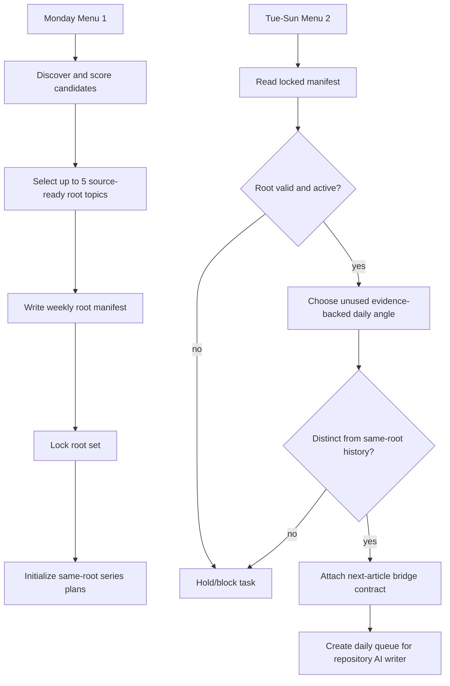
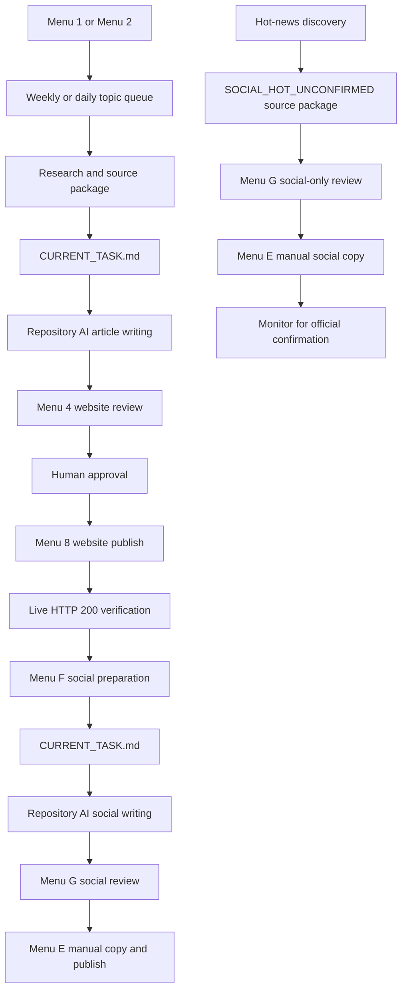
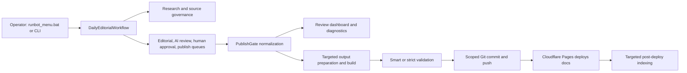
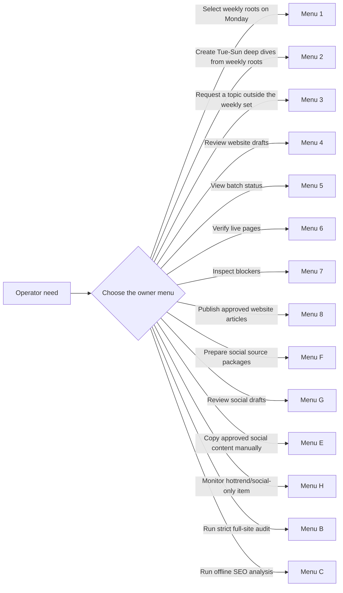
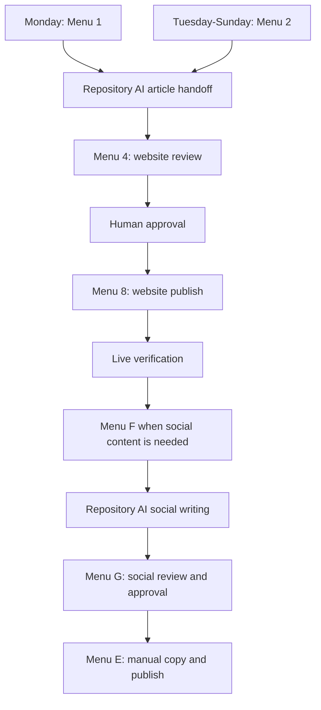
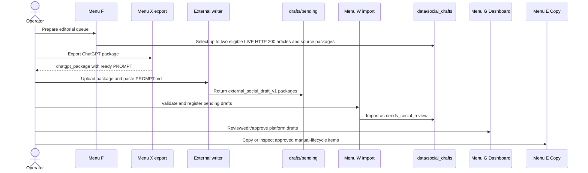
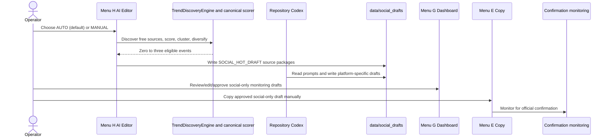
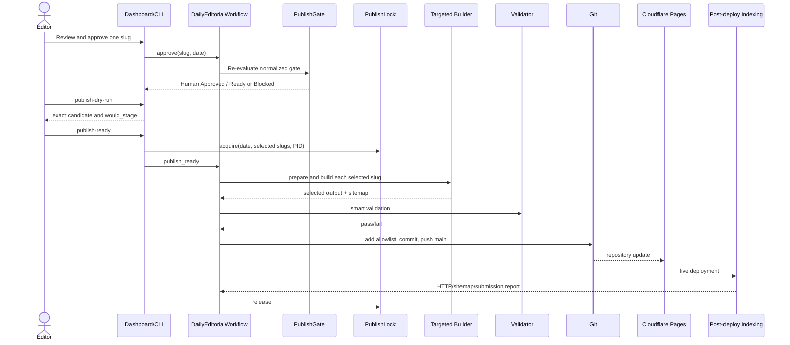
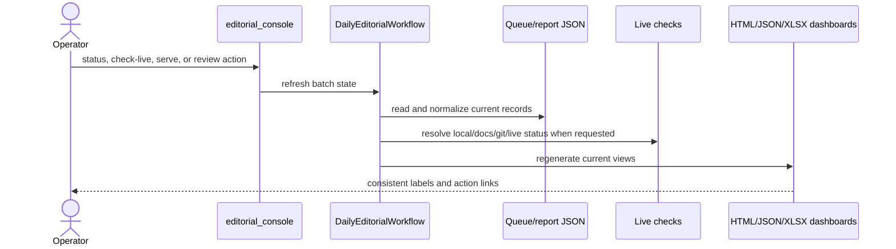
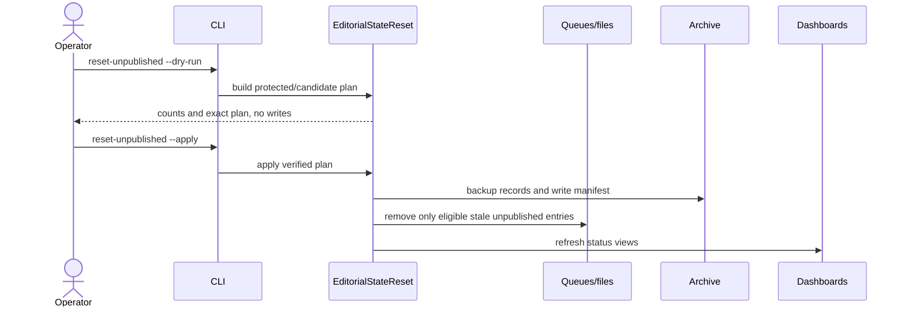

# Smile AI Review Hub Project Guide

This document is the operator and developer guide for the implementation currently in this repository. It describes observed behavior, not a proposed redesign.

Last synchronized with the repository: **2026-07-25**.

## Executive overview

Smile AI Review Hub is a Windows-operated Python editorial system and static affiliate site for `https://smileaireviewhub.com/`. The active workflow discovers topics, builds research packages and drafts, runs AI and source checks, waits for human approval, normalizes the publish gate, builds selected static output, validates it, commits a tightly scoped file set, and relies on Cloudflare Pages Git integration for deployment. Post-deploy indexing runs from GitHub Actions.

Website article writing retains its repository-local AI handoff. Social-copy writing is model agnostic and supports a file-only external-writer exchange: Menu F prepares the editorial queue, Menu X exports a complete ChatGPT package, and Menu W imports validated output from `drafts/pending/`. Legacy repository-writer task files remain compatible. None of these preparation paths calls OpenAI, `gpt-4o-mini`, a Codex API, or a heuristic writer. Publication remains a separate human-approved operation.

## Design philosophy

- **Lowest practical operating cost:** prefer repository-local processing, standard Python tooling, available no-cost data, and manual editorial operations.
- **No paid API dependency by default:** the active repository AI writing handoffs and manual social workflow do not require paid AI or social APIs. External HTTP checks, GitHub, Cloudflare Pages, and indexing providers are still part of the wider operating environment.
- **Human editorial control:** an editor reviews drafts and must explicitly approve an article before it can become eligible for publication.
- **Local-first execution:** queue preparation, writing handoffs, draft storage, dashboards, validation, and manual social-copy review run from the local repository.
- **Repository-first architecture:** files, source modules, tests, manifests, and history inside the repository are the integration surface between operator commands, repository-local writers, and external file-package writers.
- **Model-agnostic editorial operation:** a new AI must be able to read the repository, follow `AI_ONBOARDING.md`, and continue writing/reviewing without private chat history or a vendor-specific model dependency.
- **Two social workflows:** website-derived social distribution starts only after a validated Live 200 website article. A separate `SOCIAL_HOT_UNCONFIRMED` monitoring lane may create cautious social-only drafts before a website article exists, but it cannot create website content, article links, weekly roots, or publication state.
- **Deterministic and recoverable workflows:** prefer explicit task files, dated queues, normalized states, allowlisted staging, dry-runs, locks, and archived history. Some shared JSON writers and external deployment steps are not fully transactional, so operators must still inspect failures.
- **Cost-aware scaling:** scale through reusable weekly topic clusters, daily angles, targeted builds, and manual approval rather than forcing recurring API cost.

## Golden rules

1. For website-derived social distribution, the live website article is the factual source of truth.
2. Social distribution derived from a website article requires a validated LIVE HTTP 200 source article. The separate `SOCIAL_HOT_UNCONFIRMED` monitoring lane may produce cautious social-only drafts before a website article exists, but it cannot create website content, foundation roots, article links, or publication state.
3. Never publish a website article without explicit human approval and a passing normalized publish gate.
4. The repository AI writer writes requested draft files and reports its work; it does not decide approval, publication, deployment, or indexing state.
5. Workflow code owns queues, manifests, validation, metadata, and state transitions; the operator owns approve/reject and publish decisions.
6. Never force queue, approval, or publish state by editing generated JSON or reports.
7. Do not use paid APIs by default; a future exception requires an explicit approved design.
8. Social publication remains manual and is never automatically marked complete.
9. Prefer deterministic repository evidence, repeatable owner commands, and recoverable failure handling over AI guessing.
10. Commit only scoped, reviewed, intentional files.
11. Monday Menu 1 owns website root-topic selection. The selected weekly root set is locked for that editorial week.
12. Tuesday-through-Sunday Menu 2 may only create advanced website articles from those locked Monday roots. It must not invent, replace, import, or rename root topics.
13. A same-root advanced article must have a distinct reader purpose, search intent, thesis, evidence emphasis, structure, FAQ set, table purpose, CTA, conclusion, and next-article bridge.
14. Midweek hot topics go to watchlist, research monitoring, social-only consideration, rejection, or explicit human override review. They do not enter website production automatically.

Production publication is deliberately gated:

```text
AI Review -> Human Approval -> Publish Validation -> Ready for Publish -> Published -> Live 200
```

`Human Approved` is an editorial decision. `Publish Blocked` is a validation result. They are separate dimensions and can coexist until blockers are resolved.

## Weekly Root-Topic Lock

Website article production now follows a strict weekly root model.


```mermaid
flowchart TD
    M1[Monday Menu 1] --> D[Discover and score candidates]
    D --> S[Select up to 5 source-ready root topics]
    S --> W[Write weekly root manifest]
    W --> L[Lock root set]
    L --> P[Initialize same-root series plans]
    M2[Tue-Sun Menu 2] --> R[Read locked manifest]
    R --> V{Root valid and active?}
    V -- no --> H[Hold/block task]
    V -- yes --> A[Choose unused evidence-backed daily angle]
    A --> X{Distinct from same-root history?}
    X -- no --> H
    X -- yes --> B[Attach next-article bridge contract]
    B --> Q[Create daily queue for repository AI writer]
```

The authoritative weekly manifest lives under `data/editorial_queue/weeks/<week_start>/week.json`. Menu 1 writes and locks this manifest. Menu 2 treats it as read-only. The manifest records the editorial week, lock status, selected roots, watchlist/rejected candidates, root metadata, content lane, and a bounded series plan. Monday root selection is capped at 5. If only 1-4 topics meet source/readiness requirements, that smaller set is the complete foundation set for the week.

Five strong roots is the maximum Monday foundation outcome. One, two, three, or four are also valid when only that many topics pass source/readiness checks. Six or more foundation roots for the same week are invalid. The system must not force weak topics just to reach five.

### Topic Scoring And Selection Policy

`modules.ai_trend_discovery` is the canonical topic scoring owner. Menu 1 may call workflow selection helpers, but the explainable score contract, lane profiles, component normalization, missing-data behavior, thresholds, and reason codes live in that owner. Do not add another foundation-topic scorer unless the old owner is removed or explicitly delegates to the new one.

Scores use a declared `0-100` scale and profile version `topic_scoring_v2`. The active foundation profile is `FOUNDATION_MAIN`:

- recommended threshold: `65`
- absolute minimum floor: `50`
- maximum Monday foundation roots: `5`
- components: search opportunity, low-competition opportunity, affiliate/commercial opportunity, evergreen value, freshness, and CPC/commercial potential
- hard gates: site relevance, non-duplicate root/canonical, enough source evidence, safe/policy-compliant topic, and ability to support a useful article

Selection is top-down but controlled:

```text
candidate discovery
-> component scoring
-> hard-gate filtering
-> score normalization
-> descending ranking
-> recommended-threshold selection
-> quality-limited fill above the absolute floor
-> maximum five
-> weekly root lock
```

Every selected candidate records `SELECTED_THRESHOLD_PASS` or `SELECTED_QUALITY_LIMITED`. Every rejected candidate records a reason such as `REJECTED_HARD_GATE`, `REJECTED_BELOW_ABSOLUTE_FLOOR`, `REJECTED_DUPLICATE`, `REJECTED_INSUFFICIENT_EVIDENCE`, `REJECTED_LOWER_RANK`, or `REJECTED_MAX_CAP_REACHED`. Missing optional score inputs use neutral treatment with lower score confidence; missing required evidence blocks. A 0-1 input is normalized to 0-100 and reported so mixed scales are not silent.

`SOCIAL_HOT_UNCONFIRMED` and `OFFICIAL_NEWS_STANDALONE` use separate lane profiles. Social hot scoring separates `social_interest_score` from `evidence_confidence_score`; unconfirmed popularity is never website eligibility. Official-news website candidacy requires official confirmation as a hard gate.

Menu 2 cannot create a website article unless:

- a locked weekly root manifest exists for the active editorial week;
- the task's `root_topic_id` exists in that manifest;
- the root is selected and active, not watchlist/social-only/rejected;
- the daily angle is scheduled and unused for that root;
- the primary search intent is not duplicated under the same root;
- the article is meaningfully differentiated from same-root history;
- the next-article bridge points to the actual next scheduled same-root angle.

If no useful distinct angle remains, the series is paused or completed. Menu 2 must not replace it with a new root. A current-week root-set change requires explicit human override; there is no automatic emergency override.

### Content Lanes

Website and social routing use explicit content lanes:

- `FOUNDATION_MAIN`: Monday Menu 1 article for a locked weekly root.
- `FOUNDATION_ADVANCED`: Tuesday-Sunday same-root deep-dive article.
- `SOCIAL_HOT_UNCONFIRMED`: hot/trending item suitable only for social monitoring, watchlist, or cautious social copy until official confirmation exists.
- `OFFICIAL_NEWS_STANDALONE`: officially confirmed news article candidate that remains outside the locked foundation series by default.

Unconfirmed hot news must not create website articles, become a weekly root, replace a weak root, or appear in a next-article bridge. Officially confirmed news may be handled as standalone website coverage only when its own sources and validation pass; it still does not rewrite the locked weekly root set.

`SOCIAL_HOT_UNCONFIRMED` is not a Menu F website-distribution package. It has its own source contract: preserved discovery source URLs, discovery timestamp, unconfirmed status, cautious wording, no canonical website URL, no Smile AI Review Hub article URL, and a neutral CTA such as "Follow for updates as official confirmation becomes available." It may be reviewed in Menu G and copied manually through Menu E after approval, but it remains separate from website article state.

### Next-Article Bridge

Every non-final advanced website article should end with a short, natural bridge to the next scheduled same-root article. Bridge states are:

- `NEXT_SCHEDULED_NOT_LIVE`: mention the next angle but do not link or claim it is published.
- `NEXT_LIVE`: link only a verified live canonical URL for the same `root_topic_id`.
- `SERIES_COMPLETE`: do not invent a successor.
- `SERIES_PAUSED`: do not promise another article.
- `NEXT_UNKNOWN`: omit the teaser rather than fabricate one.

The repository AI writer must use the bridge contract supplied in the Menu 2 task package. It must not infer missing series data.

## Documentation authority

This guide documents behavior observed in the current repository. When documentation conflicts with implementation, use source code, tests, architecture boundary documents, and real runtime output as evidence, then correct the guide. Do not document proposed features as if they already exist. Update the synchronized date only after verifying the relevant repository behavior.

## Ownership and authority

| Owner | Current authority and responsibility |
|---|---|
| Operator | Confirms weekly/custom topics, performs human review, decides approve/reject, initiates website publication, manually publishes social content, and confirms the real final social URL. |
| Repository AI writer | Reads `CURRENT_TASK.md`, the referenced task, and the model-agnostic onboarding files; writes website or social drafts only to workflow-owned repository locations; validates the requested writing output; and reports exactly what changed. It must not edit queue/state data to force a pass. |
| Workflow code | Creates queues and research packages; owns manifests, generated metadata, validation, publish-gate evaluation, state transitions, dashboard regeneration, and manual-publish history. |
| Git and GitHub | Preserve reviewed repository history and carry only the scoped commit/push selected by the publish or maintenance task. |
| Cloudflare Pages | Deploys the tracked `docs/` output after the relevant commit reaches the configured Git branch. |
| Indexing workflow | Performs post-deploy preflight/submission where configured and writes indexing reports; it does not approve or publish articles. |

Source code and tests are the primary implementation authority when wording in this guide becomes stale. Runtime manifests and reports provide evidence of a particular execution, but generated display text does not override normalized workflow state.

## System at a glance


```mermaid
flowchart TD
    M12[Menu 1 or Menu 2] --> Q[Weekly or daily topic queue]
    Q --> R[Research and source package]
    R --> T1[CURRENT_TASK.md]
    T1 --> CA[Repository AI article writing]
    CA --> M4[Menu 4 website review]
    M4 --> H[Human approval]
    H --> M8[Menu 8 website publish]
    M8 --> L[Live HTTP 200 verification]
    L --> MF[Menu F social preparation]
    MF --> T2[CURRENT_TASK.md]
    T2 --> CS[Repository AI social writing]
    CS --> MG[Menu G social review]
    MG --> ME[Menu E manual copy and publish]
    HD[Hot-news discovery] --> HU[SOCIAL_HOT_UNCONFIRMED source package]
    HU --> HG[Menu G social-only review]
    HG --> HE[Menu E manual social copy]
    HE --> OC[Monitor for official confirmation]
```

Website publication always precedes **website-article social distribution**. It does not precede the separate `SOCIAL_HOT_UNCONFIRMED` monitoring lane, which is social-only and cannot create website articles, article URLs, canonical URLs, weekly roots, or publish state. The repository AI writer writes drafts at the two handoff steps; it does not approve or publish. Menu F selects live source articles and prepares website-distribution packages, while Menu G and Menu E preserve human review and manual publication for both social contracts.

## Zero-Human Onboarding

A new AI with access only to this repository must begin with `AI_ONBOARDING.md`. That file points to the current model-agnostic instruction stack:

- `AI_WRITER_INSTRUCTIONS.md`
- `AI_EDITOR_INSTRUCTIONS.md`
- `AI_RESEARCHER_INSTRUCTIONS.md`
- `AI_QA_INSTRUCTIONS.md`
- `EDITORIAL_MEMORY.md`
- `STYLE_ENGINE.md`
- `ARTICLE_BLUEPRINT_ENGINE.md`
- `docs/editorial/`
- `docs/examples/`
- `docs/prompts/`
- `WRITING_DNA.md`
- `STRUCTURE_DNA.md`
- `VOICE_DNA.md`
- `ARTICLE_FINGERPRINT.md`
- `DECISION_ENGINE.md`
- `SELF_VALIDATION_ENGINE.md`
- `QUALITY_SCORE_ENGINE.md`
- `MODEL_CONSISTENCY_TEST.md`

`scripts/codex_instruction_prompt.py` now injects the required model-agnostic knowledge files into generated task packages for weekly article writing, daily deep-dive writing, and social draft writing. The legacy script name remains for compatibility with existing menus and tests; its generated task text is now explicit that the AI must read the neutral knowledge base first.

The Universal Editorial Engine is now documented in `docs/editorial/UNIVERSAL_EDITORIAL_ENGINE.md`. It chains onboarding, editorial memory, writing DNA, structure DNA, voice DNA, fingerprint metrics, decision trees, blueprint, self-validation, quality scoring, and prompts into one repeatable process. A different LLM should follow these files to produce structurally consistent articles without private chat history.

### Model Consistency Benchmark

Final validation for the Universal Editorial Engine is fixture-based and isolated from production. The benchmark files live under `tests/fixtures/model_consistency/` and cover `software_review`, `comparison`, and `top_list` article types.

Each fixture contains its own `CURRENT_TASK.md`, task instructions, research package, source package, expected contract, and expected public HTML output. These fixtures are the safe place to test whether another AI can follow repository rules without touching production drafts, queues, dashboards, publish state, social state, or generated site output.

The benchmark tools are:

```powershell
python scripts/analyze_article_fingerprint.py tests/fixtures/model_consistency/software_review/expected_output/article.html --json
python scripts/score_model_consistency.py --article tests/fixtures/model_consistency/software_review/expected_output/article.html --contract tests/fixtures/model_consistency/software_review/expected_contract.json --json
python scripts/run_model_consistency_benchmark.py --json
```

`scripts/analyze_article_fingerprint.py` measures article shape, metadata, schema, headings, links, duplicate text, public-safety markers, and UTF-8/mojibake signals. `scripts/score_model_consistency.py` compares those metrics to a contract using a 100-point score with mandatory safety categories. `scripts/run_model_consistency_benchmark.py` runs all isolated fixtures.

The detailed benchmark references are `docs/editorial/AI_BENCHMARK.md` and `docs/editorial/GOLDEN_ARTICLE_REGRESSION.md`. Menu 1 and Menu 2 task packages reference these benchmark documents for website article writing. Menu F also receives the model-agnostic knowledge stack, but it remains social-platform-aware and must not force website article sections onto social drafts.

## Architecture overview


```mermaid
flowchart LR
    O[Operator: runbot_menu.bat or CLI] --> W[DailyEditorialWorkflow]
    W --> R[Research and source governance]
    W --> Q[Editorial, AI review, human approval, publish queues]
    Q --> G[PublishGate normalization]
    G --> D[Review dashboard and diagnostics]
    G --> B[Targeted output preparation and build]
    B --> V[Smart or strict validation]
    V --> X[Scoped Git commit and push]
    X --> C[Cloudflare Pages deploys docs]
    C --> I[Targeted post-deploy indexing]
```

The five ownership boundaries are defined in `architecture/FIVE_MODULE_BOUNDARIES.md`. SEO opportunity research is intentionally isolated from publication; see `architecture/SEO_ENGINE_BOUNDARY.md`.

The repository also contains a read-only multi-site foundation documented in `architecture/MULTI_SITE_AFFILIATE_ENGINE.md`. It provides validated profiles for the current site plus inactive Consumer Goods, Health, and Sports examples; isolated empty affiliate catalogs; fail-closed risk/compliance validation; a fail-closed affiliate resolver; niche-readiness diagnostics; and an immutable compatibility adapter. `config.py` remains authoritative; only `modules/site_builder.py::page_shell` resolves its displayed `site_name` through the adapter, with byte-equivalent regression coverage. Queues, canonical, sitemap, publication, deployment, and indexing remain on the existing Smile AI paths.

## Project structure

| Path | Current purpose |
|---|---|
| `editorial_console.py` | Primary editorial CLI and interactive-dashboard launcher. |
| `runbot_menu.bat` | Windows operator menu; items 10-17 use keys A-H and also accept numeric aliases 10-17. |
| `runbot_*.bat` | Week-start, Tue-Sun, custom-topic, and partner-intake wrappers. |
| `seo_console.py` | Offline SEO Engine CLI. |
| `build_site.py` | Full static-site builder; not used for a normal targeted article build. |
| `modules/` | Domain modules and orchestration support. |
| `modules/seo_engine/` | Offline keyword, cluster, gap, link, intent, and opportunity analysis. |
| `scripts/` | Build, validation, report, deploy, indexing, import, and maintenance entry points. |
| `config/` | Runtime configuration and thresholds. |
| `config/social_hot.json` | Free-source AUTO discovery, score threshold, daily cap, and company/event/category diversity settings for Menu H. |
| `config/sites/` | Validated JSON site profiles. `smile_ai_review_hub` is the active default; Health and Sports are inactive examples. |
| `data/` | Queues, source registries, research, drafts, reports, locks, history, and archives. |
| `data/sites/<site_id>/affiliate/` | New per-site partner/product/link contract. The default catalog is empty until operator-owned links are verified. |
| `data/editorial_queue/<date>/` | Batch topic source and per-batch state. |
| `data/production_article_drafts/<slug>/` | Draft HTML, Markdown, metadata, and readiness artifacts. |
| `data/published_static_pages/<slug>/` | Prepared/published static article copy. |
| `data/archive/unpublished_reset/<timestamp>/` | Reset backups and manifests. |
| `upload/<date>/` | Generated operator dashboard, review bundles, and selected publish copies. |
| `site_output/` | Built static-site output and local sitemap mirror. |
| `docs/` | Cloudflare production publish root tracked by Git. |
| `assets/` | Source visual and site assets. |
| `data/codex_tasks/` | Generated repository AI handoff instructions. This is a legacy compatibility path; `CURRENT_TASK.md` points to the latest prepared writing task. |
| `data/social_drafts/<date>/` | Manual social writing packages, platform drafts, review dashboard, image assets, and approval metadata. |
| `data/social_drafts/<date>/ranking.json` | Ranked LIVE HTTP 200 candidates and the eligible articles selected by Menu F, normally up to two. |
| `data/social_drafts/<date>/<slug>/source_package.json` | Website content, canonical URL, image, key points, and platform requirements supplied to the repository AI writer. |
| `data/social_drafts/<date>/<slug>/<platform>/` | Platform variants `A.md`, `B.md`, `C.md`, `metadata.json`, and structured output where applicable. |
| `social_drafts/`, `social_assets/`, `video_output/` | Legacy or generated manual distribution assets; no automatic social/video publishing. |
| `dashboard/`, `reports/`, `logs/` | Generated operational views, reports, and execution/indexing logs. |
| `.github/workflows/` | Health checks and post-deploy indexing automation. |
| `tests/` | Unit, integration, gate, dashboard, indexing, and safety regression tests. |
| `architecture/` | Current architecture reference set. |
| `src/`, `main.py`, `runbot.bat` | Earlier affiliate research bot retained alongside the editorial system. |

There are legacy/compatibility directories such as `draft-output`, `draft_output`, `landing_pages`, `netlify`, `temp`, and `tmp`. Their presence does not make them authoritative for the current publish flow.

## Module responsibilities

- `modules/daily_editorial_workflow.py`: main application service for batches, drafts, approval, dashboard generation, diagnostics, targeted publish, live status, and reset integration.
- `modules/weekly_root_guard.py`: deterministic weekly root manifest, Menu 2 root validation, same-root differentiation checks, series-plan metadata, and next-article bridge validation.
- `modules/publish_gate.py`: evaluates and normalizes gate state; separates active blockers, warnings, pending reviews, historical warnings, and final state.
- `modules/human_approval.py`, `modules/content_review.py`, `modules/source_review.py`: human, AI/content, and source review records.
- `modules/research_intelligence.py`, `modules/verified_source_acquisition.py`, `modules/knowledge_registry.py`: research package, verified sources, trust, and freshness.
- `modules/review_dashboard_server.py`: local HTTP server and approve/reject action boundary.
- `modules/social/draft_workflow.py`: selects live articles, creates social source packages/assets, validates platform drafts, renders the social dashboard, and owns social review/manual-publish states.
- `modules/social/hot_news_editor.py`: Menu H AUTO orchestration. It calls the existing `TrendDiscoveryEngine` and canonical social-hot scorer, then deduplicates, clusters events, applies diversity limits, and creates only `SOCIAL_HOT_DRAFT` writing packages.
- `modules/social/review_dashboard_server.py`: detached local social dashboard server, health check, local image serving, review actions, and scoped shutdown.
- `modules/social/publisher_manager.py`: `social_console.py` command implementation for preparation, review, copy, manual status, and platform adapters.
- `scripts/codex_instruction_prompt.py`: writes stable Menu 1, Menu 2, and Menu F repository AI handoff files and updates `CURRENT_TASK.md`. The filename is retained for compatibility.
- `scripts/codex_write_daily_articles.py`: repository-local article-writing entry point retained for direct controlled runs; it does not publish.
- `modules/publish_lock.py`: single-process publish lock with PID and stale-lock safeguards.
- `modules/editorial_state_reset.py`: dry-run-first archival reset for stale unpublished records.
- `scripts/build_selected_output.py`: bounded selected-slug build and sitemap refresh.
- `scripts/validate_publishing_batch.py`, `scripts/post_deploy_indexing.py`: pre-publish and post-deploy validation/submission.
- `scripts/build_ceo_dashboard.py`: consolidated dashboard/report builder.
- `modules/sitemap_generator.py`, `modules/indexing_policy.py`: public URL inclusion and sitemap generation.
- `modules/platform/site_profile.py`: read-only site-profile loading, validation, active/default selection, and production safety checks.
- `modules/platform/affiliate_data.py`, `modules/platform/affiliate_resolver.py`: validated per-site affiliate catalog and fail-closed link resolution; not yet connected to production CTA rendering.
- `modules/platform/site_runtime_config.py`: frozen legacy-authority compatibility context; profile mismatch falls back in normal mode and fails closed in strict mode.
- `scripts/analyze_article_fingerprint.py`, `scripts/score_model_consistency.py`, `scripts/run_model_consistency_benchmark.py`: isolated Universal Editorial Engine validation tools for fixture-based article fingerprint analysis, contract scoring, and benchmark execution.

## Menu 1-17

In `runbot_menu.bat`, items 10-17 are selected with `A-H` or numeric aliases: `A` exits, `B` runs strict audit, `C` opens SEO Engine, `D` opens reset stale unpublished, `E` opens the social publisher, `F` prepares the best social drafts, `G` opens the social review dashboard, and `H` prepares a hottrend social-only monitoring package. The main menu uses a typed prompt so numeric aliases and letters both work.

| Menu | Current behavior |
|---|---|
| 1 | Previews and confirms up to 5 Monday foundation root topics when source-ready candidates exist, stores and locks the weekly root set, initializes same-root series plans, prepares research, writes a repository AI handoff task under `data/codex_tasks/<date>/menu_1_write_new_articles.md`, and updates `data/codex_tasks/CURRENT_TASK.md`. It does not open the dashboard; the repository AI writer writes drafts afterward. Fewer than 5 valid roots is allowed; replacements must not be invented. |
| 2 | Reads only the current week's locked root manifest, creates at most one unused Tue-Sun angle per active Monday root, attaches differentiation and next-bridge metadata, prepares angle-specific research, writes `data/codex_tasks/<date>/menu_2_write_deep_dive_articles.md`, and updates `CURRENT_TASK.md`. It never runs trend discovery, adds a new website root, imports another week's topic, or opens the dashboard. |
| 3 | Opens custom-topic intake. |
| 4 | Resolves the latest batch that actually contains drafts, starts/reuses the local review server on port 8765, and opens only that batch. A queue-only batch does not cause an old dashboard to be reused. |
| 5 | Refreshes and prints compact batch status. |
| 6 | Builds/opens the all-article live status report. |
| 7 | Builds/opens the blocked-only live report. |
| 8 | Resolves exact Ready for Publish candidates, smart-validates, publishes, commits, pushes, then opens live status. A no-ready batch returns safely. |
| 9 | Runs affiliate partner intake and content-cluster preparation. |
| 10 | Exits. |
| 11 | Runs strict full-site validation for a selected date. |
| 12 | Opens the offline SEO Engine submenu. Queue actions are dry-run only. |
| 13 | Previews or applies stale-unpublished archival reset. |
| 14 | Opens the Social Publisher submenu. It only shows drafts already approved for manual copy and never auto-publishes. |
| 15 | Prepares social writing packages for up to two highest-ranked eligible LIVE HTTP 200 articles, writes `data/codex_tasks/<date>/menu_f_write_social_drafts.md`, updates `CURRENT_TASK.md`, and prints the short repository AI handoff instruction. |
| 16 | Starts or reuses the local social review dashboard server on port 8776 in a separate Windows process, opens the manual review UI, and immediately returns the original Runbot window to the menu. |
| 17 | Runs Menu H, the AI News Editor. AUTO uses no-key discovery followed by the dedicated `SOCIAL_HOT_NEWS_V2` profile, event clustering, Tier A/Tier B ranking, and a post-clustering diversity soft cap. It creates zero to three `SOCIAL_HOT_DRAFT` packages and a model-neutral AI task. MANUAL retains operator-supplied source monitoring. Neither mode creates a website article, weekly root, approval, publish, deploy, index, OAuth, or social API call. |
| 18 | Opens Menu I, Editorial Intelligence. Its CSV analysis, editorial memory, knowledge graph, content recommendations, and offline output benchmark write only report/intelligence artifacts and never mutate production workflow state. |

## Operator decision guide


```mermaid
flowchart LR
    O[Operator need] --> D{Choose the owner menu}
    D -->|Select weekly roots on Monday| M1[Menu 1]
    D -->|Create Tue-Sun deep dives from weekly roots| M2[Menu 2]
    D -->|Request a topic outside the weekly set| M3[Menu 3]
    D -->|Review website drafts| M4[Menu 4]
    D -->|View batch status| M5[Menu 5]
    D -->|Verify live pages| M6[Menu 6]
    D -->|Inspect blockers| M7[Menu 7]
    D -->|Publish approved website articles| M8[Menu 8]
    D -->|Prepare social source packages| MF[Menu F]
    D -->|Review social drafts| MG[Menu G]
    D -->|Copy approved social content manually| ME[Menu E]
    D -->|Monitor hottrend/social-only item| MH[Menu H]
    D -->|Run strict full-site audit| MB[Menu B]
    D -->|Run offline SEO analysis| MC[Menu C]
```

Menu E, Menu F, and Menu G do not auto-publish. Use Menu 3 rather than changing the active weekly root set when a separate custom topic is intentionally required.

## Daily operating flow


```mermaid
flowchart TD
    M1[Monday: Menu 1] --> CH1[Repository AI article handoff]
    M2[Tuesday-Sunday: Menu 2] --> CH1
    CH1 --> R4[Menu 4: website review]
    R4 --> HA[Human approval]
    HA --> P8[Menu 8: website publish]
    P8 --> LV[Live verification]
    LV --> MF[Menu F when social content is needed]
    MF --> CH2[Repository AI social writing]
    CH2 --> RG[Menu G: social review and approval]
    RG --> ME[Menu E: manual copy and publish]
```

Menu 1, Menu 2, and Menu F prepare handoff files and the repository data required for the next writing step. They do not themselves create final AI-written copy, approve it, or publish it. The repository AI writer reads the referenced task file and writes directly into workflow-owned repository storage.

Menu 8 is the website publication path. It operates only on articles that pass the existing human-approval and publish-gate rules. Social publication remains manual: Menu G reviews and approves social copy, while Menu E excludes unapproved review states and exposes approved items plus their downstream manual-publish states.

## Article and social lifecycle

Website processing uses separate state dimensions rather than one interchangeable label:

```text
QUEUE_CREATED
-> WRITING
-> DRAFT_READY
-> UNDER_REVIEW
-> HUMAN_APPROVED
-> READY_FOR_PUBLISH
-> PUBLISHED
```

- **Batch state:** the uppercase values above describe the batch's workflow progression. Topic selection and research preparation remain within `QUEUE_CREATED` until writing/draft evidence advances the batch.
- **Editorial state:** describes draft and human-review progress. Human approval records an editor decision but does not erase validation blockers.
- **Publish-gate state:** may display `Human Approval Required`, `Publish Blocked`, `Ready for Publish`, or `Published` according to normalized evidence. `Publish Blocked` is a validation outcome, not an opposite editorial decision to `Human Approved`.
- **Deployment state:** is tracked independently through output/Git/live conditions such as `Not Generated`, `Awaiting Publish`, `Awaiting Push`, and `Live 200`.

Operationally, an article moves from selected topic and prepared research to a repository-AI-written draft, AI/source review, explicit human approval, gate evaluation, `Ready for Publish`, publication, and finally live HTTP verification. Only the workflow may record these transitions.

The website-article social distribution lifecycle begins only after a live website article exists:

```text
Live website article
-> social package prepared
-> needs_social_review
-> approved_for_copy | revision_requested | rejected | not_recommended
-> pending_manual_publish
-> published_manual
```

The branches after `needs_social_review` are human review outcomes. Only `approved_for_copy` can continue to manual publication. `published_manual` requires confirmation of a real final platform URL.

`SOCIAL_HOT_UNCONFIRMED` is the separate monitoring lifecycle for hot items that do not yet have a website article. It starts from preserved discovery source URLs and timestamps, uses cautious social-only copy, and must not create a Smile AI Review Hub article URL, website draft, canonical URL, weekly root, or publish state.

## 30-second operating summary

```text
Monday:          Menu 1 -> repository AI writer -> Menu 4 -> Menu 8
Tuesday-Sunday:  Menu 2 -> repository AI writer -> Menu 4 -> Menu 8
After Live 200:  Menu F -> repository AI writer -> Menu G -> Menu E
```

Use this handoff after Menu 1, Menu 2, or Menu F:

```text
Open data/codex_tasks/CURRENT_TASK.md, follow the referenced instruction file exactly, inspect the repository, and complete the writing task. Do not approve, publish, commit, push, deploy, or use paid APIs.
```

## Daily operator workflow

1. Run menu 1 on Monday to select and persist the weekly root-topic set in `data/editorial_queue/weeks/<week_start>/week.json`.
2. On Tuesday-Sunday, run menu 2. It reuses only the active weekly roots and applies the daily implementation, comparison, pricing, use-case, troubleshooting, or buying-decision profile. A missing weekly set stops safely. If Monday stored 3 roots, Menu 2 may produce at most 3 daily angles and cannot introduce a fourth topic from discovery, hot news, social drafts, or another weekly set.
3. After menu 1 or menu 2 completes, copy the short repository AI instruction shown in the 30-second operating summary. The repository AI writer then reads `CURRENT_TASK.md`, follows the referenced task file, writes drafts directly into the existing repository data stores, and updates the dashboard-readable queues. The handoff file is complete and machine-readable; the console must not print a long prompt, use the clipboard, launch a specific AI application, call hosted LLM APIs, call `gpt-4o-mini`, use heuristic fallback, open GitHub, deploy, or index.
4. Open menu 4 and inspect the draft, AI report, source review, hard blockers, warnings, and pending reviews.
5. Approve only after human review. Approval does not bypass source, freshness, AI, image, schema, canonical, or output checks.
6. Use menu 5 or `diagnose-article` to confirm `Ready for Publish` and no hard blockers.
7. Run `publish-dry-run` for the exact slug and inspect `would_stage`.
8. Use menu 8 only when the selected set is intentional. The process acquires the publish lock, performs a bounded build, validates, stages allowlisted paths, commits, and pushes.
9. Use menu 6 to confirm `Published` and `Live 200`; inspect the indexing report after deployment.

## Content strategy model

```text
weekly root topics
-> topic clusters
-> daily deep-dive angles
-> website articles
-> internal linking
-> social distribution
-> topical authority
-> evergreen updates
```

Menu 1 targets up to 5 source-ready weekly foundation roots. Five is a ceiling, not permission to invent weak topics. If fewer pass, the smaller set is valid and authoritative for that week.

Menu 2 creates daily deep-dive angles only from roots in that manifest:

- it does not run trend discovery;
- it accepts only roots whose status is `active` or `weekly_selected`;
- it preserves `root_topic_id`, records `daily_angle`, and includes prior weekly article history;
- it creates at most one angle per eligible root for the dated queue;
- it holds a root when its daily angle lacks source readiness or collides with an angle already used that week;
- it does not replace a held root with an unrelated topic;
- rerunning Menu 2 for an existing valid dated queue reuses that queue rather than selecting new topics.

Therefore, if Menu 1 stores 4 weekly roots on Monday, every Tuesday-Sunday batch for that week is constrained to those same 4 identities. A daily batch may contain fewer than 4 if a root is inactive, lacks adequate sources for that angle, or would duplicate existing weekly coverage. It must never expand beyond those 4 by importing another topic.

Website articles form the factual and linking center of the strategy. Internal links should connect relevant cluster articles without changing canonical identity. Social copy must point back to the matching live website article. Content-strategy metadata supports selection, linking, and reporting; it cannot approve or publish content.

## Repository AI handoff task files

`scripts/codex_instruction_prompt.py` owns the operator-to-repository-AI handoff files. It writes a stable Markdown task file and updates `data/codex_tasks/CURRENT_TASK.md` only after the task file is successfully created. The script and directory names are legacy compatibility names, not a dependency on Codex as a product.

Current generated task types:

- Menu 1: `data/codex_tasks/<date>/menu_1_write_new_articles.md`
- Menu 2: `data/codex_tasks/<date>/menu_2_write_deep_dive_articles.md`
- Menu F: `data/codex_tasks/<date>/menu_f_write_social_drafts.md`

Each task file must include: task identity, objective, real date/batch information, input files to inspect, source/research files, selected topics or articles, required output paths, writing requirements, state requirements, validation checks, prohibited actions, and final report requirements. `CURRENT_TASK.md` contains only the active pointer and the short instruction to paste into the repository AI writer.

The handoff never uses clipboard automation, browser automation, hosted LLM APIs, paid APIs, Git commit/push, deployment, indexing, social APIs, or OAuth. The repository AI writer is expected to inspect the repository and write files directly under the existing workflow-owned locations.

## Manual social workflows

There are two separate social workflows.

### Workflow A: Website Article Social Distribution

Content lane: `WEBSITE_ARTICLE_SOCIAL_DISTRIBUTION`.

This workflow starts only after a website article is published and verified `Live 200`.


```mermaid
sequenceDiagram
    actor Operator
    participant F as Menu F
    participant X as Menu X export
    participant C as External writer
    participant P as drafts/pending
    participant W as Menu W import
    participant D as data/social_drafts
    participant G as Menu G Dashboard
    participant E as Menu E Copy
    Operator->>F: Prepare editorial queue
    F->>D: Select up to two eligible LIVE HTTP 200 articles and source packages
    Operator->>X: Export ChatGPT package
    X-->>Operator: chatgpt_package with ready PROMPT
    Operator->>C: Upload package and paste PROMPT.md
    C->>P: Return external_social_draft_v1 packages
    Operator->>W: Validate and register pending drafts
    W->>D: Import as needs_social_review
    Operator->>G: Review/edit/approve platform drafts
    Operator->>E: Copy or inspect approved manual-lifecycle items
```

Menu F is displayed as **Prepare Editorial Queue**. It ranks already-live website articles and selects up to the requested count, which Menu F currently sets to two. It prepares source packages only; it does not create final social copy through fixed templates and does not publish. Menu X exports the queue, sources, images, validation rules, and a ready-to-copy `PROMPT.md`. Menu W validates external output and registers it in the canonical review store. The legacy repository-writer prompt files and direct-writing path remain readable for backward compatibility, but Menu F no longer launches that handoff automatically.

### Workflow B: Hot News Monitoring

Content lane: `SOCIAL_HOT_UNCONFIRMED`.

This workflow may exist before a website article exists. `SOCIAL_HOT_DRAFT` is the queue type; `SOCIAL_HOT_UNCONFIRMED` remains the safety/content lane until official confirmation is verified. AUTO never forces three items: a day may produce zero, one, two, or three.


```mermaid
sequenceDiagram
    actor Operator
    participant H as Menu H AI Editor
    participant T as TrendDiscoveryEngine and canonical scorer
    participant C as Repository Codex
    participant D as data/social_drafts
    participant G as Menu G Dashboard
    participant E as Menu E Copy
    participant M as Confirmation monitoring
    Operator->>H: Choose AUTO (default) or MANUAL
    H->>T: Discover free sources, score, cluster, diversify
    T-->>H: Zero to three eligible events
    H->>D: Write SOCIAL_HOT_DRAFT source packages
    C->>D: Read prompts and write platform-specific drafts
    Operator->>G: Review/edit/approve social-only monitoring drafts
    Operator->>E: Copy approved social-only draft manually
    E->>M: Monitor for official confirmation
```

AUTO owner command:

```powershell
python social_console.py prepare-hot-news-auto --date YYYY-MM-DD
python social_console.py prepare-hot-news-auto --date YYYY-MM-DD --dry-run
```

MANUAL owner command:

```powershell
python social_console.py prepare-hot-news-monitoring --date YYYY-MM-DD --title "..." --source-url https://source.example/item --discovery-timestamp 2026-07-23T08:00:00Z
```

Operator shortcut: choose **Menu H / 17**. Press Enter for AUTO. AUTO reads `config/social_hot.json`, scans only the no-key connector allowlist and configured public feeds, then prints a compact summary and writes the complete candidate/rejection evidence under `data/reports/social_hot/<date>/`. Choose `M` for the retained manual title/source path.

AUTO packages are intentionally `needs_social_draft`; fixed templates are not presented as final copy. A repository AI writer reads `data/ai_tasks/CURRENT_AI_TASK.md` and the selected evidence, then writes platform variants before Menu G review. Legacy `data/codex_tasks/CURRENT_TASK.md` remains compatible. This repository-local handoff is the no-paid-API writing boundary; Menu H does not call an OpenAI, Anthropic, Gemini, search, news, scraping, or social API.

`SOCIAL_HOT_UNCONFIRMED` drafts preserve source URLs and discovery timestamp, use cautious wording, and may use a neutral CTA such as following for updates. They must not require a `Live 200` website article, must not create or modify `data/production_article_drafts/`, must not create or modify weekly root manifests, must not fabricate a Smile AI Review Hub article URL, and must not enter a foundation-series bridge. If official confirmation later exists, the topic may be evaluated separately as `OFFICIAL_NEWS_STANDALONE`; that promotion does not rewrite the original social history or automatically publish a website article.

The AUTO editorial sequence is:

```text
free discovery -> normalize -> exact deduplicate -> event cluster
-> SOCIAL_HOT_NEWS_V2 hard gates and score
-> Tier A rank -> Tier B rank -> diversity soft cap
-> SOCIAL_HOT_DRAFT queue -> model-neutral repository AI task
```

The default daily cap is three and zero is valid. Positive weights total 100: recency 22, source authority 17, user/business impact 16, official confirmation 13, novelty 9, social discussion potential 8, practical relevance 7, company significance 5, and evidence confidence 3. Duplicate, near-duplicate, stale, low-authority, recycled SEO, eventless opinion, and weak-relevance penalties are applied separately. Tier A starts at 72, Tier B at 55, evidence confidence at 35, and the stale cutoff is 14 days. These values, official domains, organization/product aliases, free feeds, and soft diversity caps are configurable in `config/social_hot.json`.

Required gates are a valid HTTP(S) source, title, determinable publication time/date, sufficient evidence for safe wording, duplicate-event protection, and project safety/relevance. Missing author, image, secondary source, full description, detailed company mapping, or feed-specific metadata lowers confidence or adds a warning but is not a generic hard block. Unconfirmed stories remain `SOCIAL_HOT_UNCONFIRMED` with explicit known/unknown facts and safe-wording guidance.

Credential-backed X, LinkedIn, YouTube, paid search/news, and paid scraping connectors are not in the AUTO allowlist.

Menu G is the only social review surface. It previews full content, images, URL, CTA, hashtags/tags, platform metadata, and reviewer notes. Approval changes only social draft copy status. It does not publish to any social network.

Menu E excludes `needs_social_review`, revision, rejected, and not-recommended drafts. Its approved-item listing includes `approved_for_copy` and the downstream `pending_manual_publish` and `published_manual` states so the operator can continue or inspect manual publication. It copies UTF-8 content and records `published_manual` only after an explicit operator confirmation with the final published URL. It never auto-publishes, never uses social APIs, and never marks an item published automatically.

When writing Vietnamese social copy, store and render UTF-8 text directly. Replacement question marks, malformed diacritics, or Unicode replacement characters indicate corrupted draft data and must be fixed in the draft Markdown and `metadata.json`, then `social_console.py review-dashboard --date <date>` should be run to rebuild the dashboard.

### Social platforms and draft contract

The current social review set contains 14 platform targets:

```text
Facebook English, Facebook Vietnamese, LinkedIn, X, Quora, Dev.to,
Pinterest, Product Hunt, Threads, Bluesky, Medium, Hashnode, Blogger,
and Telegram
```

The external-writer exchange uses a stable core subset of eight files:

```text
facebook_vi.md, facebook_en.md, linkedin.md, x.md, quora.md,
devto.md, blogger.md, pinterest.md
```

Additional canonical platforms remain supported by the existing repository-writer and dashboard contracts. Importing the eight-file external package does not remove or disable those platforms.

For each selected article and platform, the writing contract is:

- `A.md`, `B.md`, and `C.md`: distinct reviewable copy variants;
- `metadata.json`: full title, body, CTA, hashtags/tags, complete live website URL, image fields, selected version, validation warnings, reviewer notes, and status;
- `assets/<platform>.png`: local upload-ready image generated or reused by the workflow when supported;
- UTF-8 storage and rendering with no truncated title, body, URL, or multibyte Vietnamese text.

The normal state progression is:

```text
needs_social_review
-> approved_for_copy | revision_requested | rejected | not_recommended
-> pending_manual_publish
-> published_manual
```

Only a human action in Menu G can move a draft to `approved_for_copy`. Menu E cannot see `needs_social_review` drafts. `published_manual` requires an explicit confirmation and final platform URL; copying content does not mark it published.

### External writer exchange (Menu X and Menu W)

The exchange is a file-only compatibility layer, not a second publishing system.

```text
Menu H and/or Menu F
-> Menu X: chatgpt_package/
-> external writer
-> drafts/pending/<slug>/
-> Menu W
-> data/social_drafts/<date>/<slug>/
-> Menu G
-> human approval
-> Menu E manual copy/publish
```

Menu X writes:

- `chatgpt_package/README.md`;
- `chatgpt_package/PROMPT.md`;
- `chatgpt_package/queue.json`;
- `chatgpt_package/validation_rules.md`;
- `chatgpt_package/official_sources/<slug>/source_package.json`;
- `chatgpt_package/images/<slug>/` when local source assets exist.

Each external article directory uses schema `external_social_draft_v1` and contains
`metadata.json`, the eight required Markdown files listed above, and an optional
`images/` directory. `metadata.json` owns the exact batch, slug, title, supplied source
URLs, content lane, writer provider, and per-platform title/CTA/hashtags/language.
The writer provider is informational and may be `chatgpt`, `claude`, `gemini`, `human`,
or another external writer.

Menu W validates the complete article package before writing canonical files. It rejects
missing/empty files, invalid slugs or dates, unsupported entry states, absent source URLs,
UTF-8 damage, and incomplete platform metadata. It refuses to overwrite any platform
with approval, rejection, revision, not-recommended, pending-publication, published, or
review-history state. Successful imports always enter as `needs_social_review` with
`approved_for_copy=false`. Re-importing identical bytes is a no-op.

Menu G runs the same idempotent pending-package registration before opening the dashboard,
so valid packages are discovered even when the operator skips Menu W. Menu W remains the
preferred explicit validation step because it prints every imported, unchanged, and
rejected package. Menu E remains unchanged and therefore cannot see imported drafts until
a human approves them in Menu G.

Neither Menu X nor Menu W calls an AI API, OAuth, a social API, deployment, indexing,
Git commit/push, or website publication.

### Self-improving research acquisition

The research layer expands evidence before Menu X instead of lowering the export gate:

```text
research package
-> approved source inventory
-> official source-family expansion
-> paragraph extraction and cache
-> validated factual claims
-> section coverage (Missing / Weak / Strong)
-> evidence-gap report
-> ARTICLE_READY or BLOCKED_RESEARCH
-> Menu X
```

The engine only follows approved official families: official website, documentation,
GitHub/README, pricing, FAQ/help center, release notes/changelog, official blog,
API docs, marketplace, examples, and tutorials. A linked GitHub repository is
allowed; unrelated blogs are not added automatically. Each weak section receives
recommended source families in `evidence_gap_report.json`.

Claim targets depend on article type. A comparison or top-list article needs more
evidence than news or a tutorial. `ARTICLE_READY` requires both enough validated
claims and sufficient section coverage. A large claim count cannot compensate for
missing mandatory sections.

The engine remembers successful official sources in
`data/official_source_registry.json`. Retrieved bodies are cached by URL with
content hashes, `ETag`, and `Last-Modified`; unchanged pages reuse validated claims.
Changed pages are re-extracted and revalidated. This lets later runs start with
known source families while preserving the same safety gates.

Research artifacts written for each slug:

- `SOURCE_EXCERPTS.json`: actual relevant source paragraphs;
- `FACT_LEDGER.json`: 20-100 directly supported, article-ready claims when available;
- `ARTICLE_BLUEPRINT.json`: section-aware claim assignments;
- `evidence_coverage.json`: Missing/Weak/Strong coverage and score;
- `evidence_gap_report.json`: exact gaps and recommended official source families;
- `source_expansion_report.json`: discovered official sources and expansion ceiling;
- `enrichment_report.json`: readiness, blockers, cache key, and cache reuse state.

Run or refresh enrichment without writing or publishing:

```powershell
python external_writer_console.py enrich-research --date YYYY-MM-DD
python external_writer_console.py enrich-research --date YYYY-MM-DD --refresh-sources
```

Menu X continues to block `BLOCKED_RESEARCH`. It never fabricates missing facts,
opens random third-party blogs, writes an article, approves content, or publishes.

### Entity Knowledge Base and partial research recovery

Verified evidence is also persisted under:

```text
data/entity_knowledge_base/<entity_id>/
  profile.json
  sources.json
  paragraphs.json
  claims.json
  conflicts.json
  usage_history.json
```

The knowledge base retains source and paragraph provenance, content versions,
claim state, limitations, prohibited extrapolations, freshness, aliases, official
domains, and article usage history. Reuse requires an exact resolved entity,
relevant claim category, active claim state, fresh verified source, and a
compatible article intent. Keyword similarity alone is never sufficient.

Source changes preserve prior versions. Claims may become `ACTIVE`, `STALE`,
`SUPERSEDED`, `CONFLICTED`, `RETRACTED`, `ENTITY_MISMATCH`, or `UNUSABLE`.
Material conflicts remain in the audit trail and force cautious language or a
refresh; history is not silently deleted.

Menu X uses safe partial-batch recovery by default. It exports only
`ARTICLE_READY` website tasks and writes `batch_selection.json` with both exported
and held task IDs. Held tasks remain pending with their blockers and can be
enriched into a later immutable package. No replacement topics are created, and
the weekly root lock is unchanged. Set `research_enrichment.partial_batch_export`
to `false` only when an operator explicitly needs the legacy all-or-nothing policy.

Normal operation remains:

```text
Menu 1 / Menu 2 / Menu F
-> automatic enrichment and evidence memory
-> Menu X verified ZIP
-> external writer
-> completed_drafts.zip
-> Menu W
-> human review
-> publish workflow
```

Manual enrichment commands are diagnostic/recovery tools only. No paid API,
API key, search-engine scraping, approval, publish, Git, deploy, or indexing
action is part of research acquisition.

### Platform-specific output

- Facebook English and Vietnamese use natural short paragraphs, a CTA, the full website URL, and relevant hashtags. Vietnamese source Markdown and metadata must remain valid UTF-8.
- LinkedIn uses professional insight and a complete URL. Its link-preview image is controlled by the website's live Open Graph metadata; the local PNG remains available for manual upload.
- X is clipped to the configured character limit and keeps a complete clickable URL plus minimal hashtags.
- Quora copy contains only the public answer text. Internal drafting labels such as `Suggested question: Quora answer draft` and `# Quora answer draft` must never appear in Copy All output.
- Dev.to uses clean Markdown and structured metadata. A canonical URL belongs in Dev.to's canonical/front-matter field; the literal internal label `Canonical URL note:` must not be pasted into the public article.
- Pinterest exposes pin title, description, destination URL, suggested board, keywords, alt text, and a portrait local image. Manual publication status is tracked separately.
- Blogger creates a companion article rather than a duplicate repost. Its structured output includes `A.md`, `article.html`, `metadata.json`, `plain_text_body`, `html_body`, labels, slug, search description, JSON-LD, image metadata, SEO metrics, and validation results.
- Bluesky contains a standalone post and a short thread; each post is validated against the configured character limit instead of copying article paragraphs.
- Medium, Hashnode, Threads, Product Hunt, and Telegram use platform-adapted copy while preserving the complete live source URL and avoiding internal workflow labels.

The dashboard's Copy All renderer produces paste-ready public copy. It removes internal headings/debug labels, preserves the full URL, includes hashtags where the platform uses them, and avoids duplicating CTA, disclosure, source link, or canonical text. A URL pasted as plain text remains clickable on platforms that auto-link HTTP URLs; local image files must still be uploaded manually when the platform does not generate a usable Open Graph preview.

### Social dashboard server lifecycle

Menu G launches `social_console.py launch-review-dashboard --date latest --open`. On Windows, the launcher uses `subprocess.CREATE_NEW_CONSOLE`, stores PID/host/port/date in the runtime state file, and returns control to `runbot_menu.bat`.

- `GET /health` returns service health and identifies the social dashboard process.
- `GET /favicon.ico` returns HTTP 204 to avoid harmless 404 noise.
- A healthy server already using port 8776 is reused; a duplicate server is not started.
- If port 8776 belongs to another or unhealthy process, that process is not terminated. The launcher reports the condition and chooses the next available local port.
- `Close Dashboard Server` calls the local `/api/social/stop` endpoint and shuts down only this dashboard server.
- `Back to Runbot Menu` explains that the browser cannot control the existing CMD window and may close only its own tab when browser permissions allow.

The social dashboard is local operator tooling. It is not deployed under `docs/` and it never publishes, commits, pushes, deploys, indexes, invokes OAuth, or calls a social API.

### Social batch status

Social batch counts and review states are generated operational data and change as editors work. Inspect the latest dated manifest, platform `metadata.json` files, or Menu G/Menu E instead of treating a dated snapshot in this guide as current state.

## Approval and publish workflow


```mermaid
sequenceDiagram
    actor Editor
    participant UI as Dashboard/CLI
    participant WF as DailyEditorialWorkflow
    participant PG as PublishGate
    participant L as PublishLock
    participant B as Targeted Builder
    participant V as Validator
    participant Git
    participant CF as Cloudflare Pages
    participant IX as Post-deploy Indexing
    Editor->>UI: Review and approve one slug
    UI->>WF: approve(slug, date)
    WF->>PG: Re-evaluate normalized gate
    PG-->>UI: Human Approved / Ready or Blocked
    Editor->>UI: publish-dry-run
    UI-->>Editor: exact candidate and would_stage
    Editor->>UI: publish-ready
    UI->>L: acquire(date, selected slugs, PID)
    UI->>WF: publish_ready
    WF->>B: prepare and build each selected slug
    B-->>WF: selected output + sitemap
    WF->>V: smart validation
    V-->>WF: pass/fail
    WF->>Git: add allowlist, commit, push main
    Git-->>CF: repository update
    CF-->>IX: live deployment
    IX-->>WF: HTTP/sitemap/submission report
    UI->>L: release
```

Dry-run accepts only a final normalized state of exactly `Ready for Publish`. It performs no build, output write, queue mutation, Git action, approval, deployment, or indexing submission. Real publishing rejects unrelated or whole `upload/<date>` paths through an explicit stage-scope assertion.

## Dashboard generation flow


```mermaid
sequenceDiagram
    actor Operator
    participant CLI as editorial_console
    participant WF as DailyEditorialWorkflow
    participant Q as Queue/report JSON
    participant Live as Live checks
    participant Dash as HTML/JSON/XLSX dashboards
    Operator->>CLI: status, check-live, serve, or review action
    CLI->>WF: refresh batch state
    WF->>Q: read and normalize current records
    WF->>Live: resolve local/docs/git/live status when requested
    WF->>Dash: regenerate current views
    Dash-->>Operator: consistent labels and action links
```

The dashboard is generated output. Use menu 4/5 or CLI refresh commands rather than editing HTML. Published rows use `Published` as final state; legacy warnings remain only in audit/history fields, not active blockers.

## Queue lifecycle

See `architecture/QUEUE_ARCHITECTURE.md`. In summary: discovery writes the dated topic queue; research/source/AI review enrich it; human review records a decision; publish gate writes normalized state; selected publication records local/published/live history. Queue JSON is source data owned by the workflow, not an operator editing surface.

## SEO Engine workflow

Menu 12 imports keyword signals, builds clusters, analyzes gaps, plans internal links, scores opportunities, and writes offline reports. `queue-opportunity` and `queue-top` are preview/dry-run boundaries and do not approve or publish editorial articles. See `architecture/SEO_ENGINE_BOUNDARY.md`.

## Reset stale unpublished


```mermaid
sequenceDiagram
    actor Operator
    participant CLI
    participant Reset as EditorialStateReset
    participant Q as Queues/files
    participant A as Archive
    participant D as Dashboards
    Operator->>CLI: reset-unpublished --dry-run
    CLI->>Reset: build protected/candidate plan
    Reset-->>Operator: counts and exact plan, no writes
    Operator->>CLI: reset-unpublished --apply
    CLI->>Reset: apply verified plan
    Reset->>A: backup records and write manifest
    Reset->>Q: remove only eligible stale unpublished entries
    Reset->>D: refresh status views
```

Published/live records, current active batch data, selected SEO work, docs/site output, published static pages, sitemap, and live history are protected. Apply archives first; it does not silently delete protected content.

## Locking and timeout strategy

- `data/publish.lock` records PID, start time, date, slugs, and command.
- An active lock blocks another publish. It is released in a `finally` path.
- A stale lock is not automatically cleared; use `publish-lock-status`, then `clear-stale-publish-lock --confirm` after PID verification.
- Targeted build timeout defaults to 180 seconds and permits at most one retry.
- General subprocess timeout defaults to 600 seconds. Timeout errors include the stderr tail.
- The CLI prints periodic progress for long publish operations.

## Build, validation, deployment, and indexing

Targeted publishing copies the selected draft HTML to `data/published_static_pages`, `site_output`, `docs`, and `upload/<date>/published`, then runs `scripts/build_selected_output.py` for bounded asset/sitemap work. Full `build_site.py` is reserved for full-site maintenance.

Smart validation scopes checks to selected publish candidates. Strict mode validates the complete `site_output` and `docs` trees and remains capable of reporting historical defects. Checks include gate state, local/docs output, image, canonical, structured data, sitemap, language/content integrity, and link/page requirements implemented by the validators.

Cloudflare Pages deploys the tracked `docs/` tree after push to `main`. `.github/workflows/post-deploy-indexing.yml` derives changed URLs and invokes `targeted_publish_preflight`; unrelated historical `/review/` defects do not block that selected set. `strict_full_site_audit` remains available for whole-site auditing. IndexNow is submitted when configured; Google/Bing Webmaster results explicitly use `skipped_credentials_missing` when secrets are absent. Non-strict indexing records failure without rolling back a successful deploy. `netlify.toml` is compatibility/legacy configuration and is not the active production deployment path.

## Generated outputs and manual-edit policy

Never edit these by hand:

- queue and state files under `data/`, especially `publish_queue.json`, `human_approval_queue.json`, review queues, live history, and `publish.lock`;
- `data/production_article_drafts/<slug>/index.html` after workflow generation unless using an approved source/template change;
- `data/published_static_pages/`, `site_output/`, `docs/`, and `upload/` generated article/dashboard copies;
- generated sitemap, dashboard HTML/JSON/XLSX, validation reports, indexing reports, repository AI task files, social manifests/status metadata, and video output;
- archive manifests or history JSONL files.

Edit source modules, templates/configuration, or curated input registries, then regenerate through the owning command. Never hand-edit article state to force a gate pass.

Social copy files are a deliberate exception to the general generated-output rule: the repository AI writer writes `A.md`, `B.md`, and `C.md`, and the editor may revise their content through Menu G. Do not hand-edit `ranking.json`, `source_package.json`, approval status, selected-version state, manual-publish history, or server runtime state to force a social workflow transition.

Large pending-change counts in VS Code are expected after generation, dashboard refresh, publish attempts, social draft creation, and report builds. Treat them as dirty worktree inventory, not as approval to commit everything. Before committing, use scoped `git status --short <path>` and stage only the requested source/config/test/doc files or the explicitly approved generated artifacts. Do not clean, reset, delete, or revert unrelated generated files while another task is in progress.

## Never do this

- Do not use paid AI, social, or other APIs in the active writing/manual-distribution workflow.
- Do not auto-approve website articles or social drafts.
- Do not auto-publish social content.
- Do not bypass validation, source requirements, human approval, or publish gates.
- Do not edit generated queue/state files to force success.
- Do not manually rewrite `ranking.json`, `source_package.json`, approval state, selected-version state, or publish history.
- Do not add unrelated daily topics when an active weekly root set exists.
- Do not commit unrelated dirty or generated files.
- Do not clean, reset, delete, or revert unrelated work.
- Do not deploy or index as a side effect of tests.
- Do not casually move modules or change repository structure.
- Do not invent a parallel workflow when an owner command or existing data contract already exists.
- Do not replace the current GitHub-to-Cloudflare Pages publication flow without a separate approved design.

### Never ask the repository AI writer to

- approve website articles or social drafts;
- publish website or social content;
- commit or push unless a separate explicit task authorizes it;
- deploy or index content;
- bypass human approval, source validation, or the publish gate;
- manually rewrite queue/state files to force a transition;
- rewrite `ranking.json` or `source_package.json` to force selection;
- mark social content published without a real final platform URL;
- call paid OpenAI, social, or external APIs;
- clean, reset, delete, or revert unrelated dirty files;
- invent Menu 2 topics outside the active weekly root manifest;
- redesign or replace the current architecture without a separate approved design task.

## Developer workflow

1. Read this guide and the relevant boundary document.
2. Inspect `git status` because generated output may already be dirty.
3. Make a narrowly scoped source/test/documentation change.
4. Run targeted tests, then `python -m pytest` for runtime changes.
5. Use diagnostics and dry-run before any publish-path test.
6. Stage explicit paths and inspect `git diff --cached --name-only`.
7. Never publish a real article as a side effect of testing.

## Safe maintenance procedures

- Use `validate-batch --mode smart` for selected daily work and menu 11 for deliberate full-site audit.
- Use `reset-unpublished --dry-run` before `--apply`.
- Use `recover-interrupted-preparation` only with `--confirm` and only when its safeguards match.
- Do not clear a lock until the recorded PID is confirmed inactive.
- Do not run full-site regeneration during a one-article publish unless a reproducible dependency requires it.
- Keep editorial status, deployment status, and historical diagnostics separate.

## Troubleshooting

- Approval appears silent: keep the local `serve` terminal open, check the URL `message` parameter, refresh menu 5, and run `diagnose-article`. Approval may succeed while the publish gate remains blocked.
- No article ready: this is an operational state. Open menu 4 for gate reasons; menu 8 returns to the menu without committing or pushing.
- Lock blocks publish: run `publish-lock-status`; clear only a verified stale lock with `--confirm`.
- Targeted build times out: inspect its stderr tail, fix the selected bundle, and retry once; do not start a full build automatically.
- `Missing Local Output` or `Docs Pending`: run `build-selected` only for an exact Ready for Publish slug.
- Live page is absent after push: use `check-live --all`, then inspect Cloudflare deployment and indexing logs. Indexing failure does not undo deployment.
- Strict audit reports `/review/` history: fix it as separate full-site maintenance; targeted publish preflight intentionally ignores unrelated URLs.

## Common commands

```powershell
python editorial_console.py status --date YYYY-MM-DD --json
python editorial_console.py diagnose-article --date YYYY-MM-DD --slug SLUG
python editorial_console.py diagnose-batch --date YYYY-MM-DD
python editorial_console.py publish-dry-run --date YYYY-MM-DD --slug SLUG
python editorial_console.py build-selected --date YYYY-MM-DD --slug SLUG --timeout 180
python editorial_console.py validate-batch --date YYYY-MM-DD --mode smart
python editorial_console.py validate-batch --date YYYY-MM-DD --mode strict
python editorial_console.py check-live --all --open
python editorial_console.py publish-lock-status
python editorial_console.py reset-unpublished --dry-run
python editorial_console.py reset-unpublished --apply
python scripts/post_deploy_indexing.py --preflight-mode targeted_publish_preflight --urls-file data/published_today.json
python social_console.py prepare-drafts --date latest --count 2 --platforms all
python social_console.py export-chatgpt-package --date latest
python social_console.py import-external-drafts --date latest --refresh-dashboard
python social_console.py review-dashboard --date YYYY-MM-DD
python social_console.py launch-review-dashboard --date latest --open
python social_console.py dashboard-health --port 8776
python social_console.py approved-for-copy --date latest
python social_console.py copy-approved --date latest --index 1 --field all
python social_console.py stop-review-dashboard --port 8776
python scripts/validate_site_profiles.py --production-check
python scripts/show_site_profile.py --site smile_ai_review_hub --production-check
python scripts/show_site_runtime_config.py --site smile_ai_review_hub
python scripts/show_site_runtime_config.py --site smile_ai_review_hub --strict
python scripts/report_niche_readiness.py
python scripts/report_niche_readiness.py --json
python scripts/report_site_profile_drift.py --site smile_ai_review_hub
python scripts/report_site_profile_drift.py --site smile_ai_review_hub --json
python scripts/report_site_profile_drift.py --site smile_ai_review_hub --strict
python scripts/run_model_consistency_benchmark.py --json
python -m pytest
```

## Current limitations and technical debt

- The repository contains substantial tracked/generated output, so a full build can produce a very large dirty worktree.
- Queue/state data is shared JSON rather than a transactional database; the publish lock protects publish execution, not every writer.
- Dashboard refresh combines several report sources and can expose stale data until regeneration.
- Cloudflare deployment completion is external and eventually consistent.
- Search submissions depend on credentials and provider availability; missing credentials are expected skips.
- Historical `/review/` and legacy generated URLs can still fail strict full-site audit.
- Both old affiliate-bot entry points and the newer editorial platform remain in one repository.
- Netlify compatibility configuration remains although Cloudflare is active.
- Social publication remains manual. Some platforms generate link-preview images from live Open Graph metadata while others require uploading the generated local PNG.
- Platform composer behavior changes outside this repository; Copy All prepares complete content but cannot guarantee how each third-party UI renders links, images, Markdown, or hashtags.
- Blogger and Bluesky have richer structured generators; the remaining social platforms primarily use Markdown variants plus common metadata.
- The multi-site platform layer remains foundation-only. Consumer Goods, Health, and Sports are inactive `.invalid` examples with separate empty affiliate catalogs. Health is marked high-risk/regulated and requires expert review, disclaimers, official sources, and at least three usable sources at profile validation. These controls do not yet route a second site's editorial workflow. `page_shell.site_name` is the sole adapter-backed renderer field, while `config.py` stays authoritative and Smile AI-specific fallback strings remain elsewhere. No other site can currently build, publish, deploy, or index.
- Legacy affiliate CSV/program-page data is intentionally not auto-migrated into the new catalog because it does not prove an operator-owned tracking link.
- The read-only profile drift analyzer reports current/profile differences, bounded hardcodes, integration status, and migration readiness. It does not make the profile authoritative, inspect arbitrary environment variables, expose credentials, or write a report unless `--output` is supplied.

## Project evolution

The repository contains historical layers that still coexist:

1. the original affiliate research bot and retained entry points;
2. the editorial queue, research, and draft workflow;
3. human approval, normalized publish gates, and targeted publication;
4. GitHub-backed Cloudflare Pages deployment and post-deploy indexing;
5. the offline SEO Engine and content-strategy metadata;
6. the repository-local AI article-writing handoff;
7. the manual social preparation, repository AI writing, review, copy, and publication workflow.

This is an architectural evolution summary, not an official release chronology. Legacy paths remain for compatibility or historical output and are not automatically authoritative for current operations.

## Safe extension points

- Add a validator behind the existing smart/strict interfaces.
- Add dashboard fields from normalized status, keeping active and historical diagnostics separate.
- Add an SEO analyzer inside `modules/seo_engine/` without writing approval/publish queues.
- Add a deployment/indexing provider behind existing report contracts and non-strict semantics.
- Add queue adapters that preserve current JSON schemas and audit history.
- Add targeted asset builders that accept an explicit slug and pass stage-scope checks.
- Add a performance tracker from available no-cost data.
- Add internal-link optimization proposals without automatically rewriting published pages.
- Add keyword-gap and topical-authority reports.
- Add evergreen-content update suggestions that require human review.
- Add a read-only broken-link checker.
- Add a weekly operating report derived from current queues and runtime reports.
- Add content analytics adapters for available no-cost sources.
- Extend the compatibility adapter to another single field/component only after a separate drift review and exact output-parity checkpoint. Do not combine renderer, canonical, sitemap, publish, or deployment migration.

Future extensions default to no paid API, no automatic approval, no automatic social publication, and no publish-state mutation outside the owning workflow. New behavior should be proposed and reviewed before implementation.

## Universal External Writer Pipeline

### Kiem tra ZIP tra ve truoc Menu W

Dung cung mot validator voi Menu W:

```powershell
python external_writer_console.py validate-completed "completed_drafts.zip" --package "verified_package.zip" --json --report "validation_report.json"
```

Neu ket qua la `VALIDATION_PASS`, Menu W se dung cung validation path va khong
duoc chan ZIP bang mot bo quy tac khac. Loi public-output marker luon kem
`task_id`, `slug`, file, rule ID, marker, matcher, line, column, character
offset, snippet, location type va cach sua.

Sau khi sua noi dung, khong sua checksum bang tay. Giai nen ZIP vao mot thu
muc, sau do chay:

```powershell
python external_writer_console.py rebuild-completed-manifest "completed_drafts_directory" --output "completed_drafts_fixed.zip"
```

Lenh nay giu nguyen package ID, task ID, slug va revision; tinh lai SHA-256,
tao ZIP va tu choi tao dau ra neu van con blocker. Cac cum tu cong khai binh
thuong nhu `workflow`, `review`, `editorial`, `internal`, `validation`,
`approval`, `research package` va dau dong JSON-LD `}}` khong bi chan rieng
le. Token trang thai noi bo, duong dan repo, JSON workflow state, internal
comment va placeholder day du van bi chan.

Routine content writing is decoupled from Codex and from paid APIs:

```text
Website: Menu 1/2/3 -> X -> external AI writer -> W -> 4 -> approval -> 8
Social:  Menu F/H   -> X -> external AI writer -> W -> G -> approval -> E
```

Menu X creates one upload-ready ZIP. Menu W discovers and validates the returned
ZIP without manual extraction. The neutral queue is `data/write_queue/`; legacy
`data/ai_tasks/` and `data/codex_tasks/` remain compatibility inputs.

New Menu X packages are self-contained verified packages. The canonical ZIP
name ends in `_verified_package.zip`; the old `_ready_for_chatgpt.zip` alias is
kept temporarily for backward compatibility. The package contains the exact
article blueprints, fact ledger, source excerpts, entity profiles, writing DNA,
structure DNA, voice DNA, self-review rules, quality scoring, machine-readable
validation/output contracts, and a golden process example. Production export
is refused when core evidence or required context is incomplete.

Evidence packages use schema v2. Every production article requires 20-100
publishable claims extracted from actual approved-source paragraphs. Each claim
must include its source URL, exact supporting excerpt, allowed usage,
limitations, freshness, and confidence. Source registry notes and topic
readiness messages are never treated as article facts. If the research package
does not contain enough actual paragraphs, Menu X stops and the topic must
return to source enrichment. The external writer does not need to open or
revisit any website.

Validate a package without repository context:

```powershell
python validate_verified_package.py "C:\path\to\verified_package.zip"
```

Or use the external writer console:

```powershell
python external_writer_console.py validate-package "C:\path\to\verified_package.zip"
```

Universal Writer Test instruction for a brand-new conversation:

```text
Read START_HERE.txt.
Complete every article.
Return completed_drafts.zip.
```

Upload only the verified ZIP and send only that instruction. If the writer asks
for repository access, prior chat history, URLs to revisit, missing structure,
or editorial clarification, the package fails and must not be imported.

Menu W never trusts returned approval or publish fields. Website drafts are
registered in `data/production_article_drafts/` and existing review queues.
Social drafts are registered in `data/social_drafts/` as
`needs_social_review`. Menu 8 and Menu E retain their existing human gates.
New returns include the unchanged `verified_package_contract.json` and its
SHA-256 checksum. Menu W uses that exported snapshot as its validation source of
truth; current repository data is used only after validation to register the
draft and update workflow state.

Menu 3 now prepares custom-topic research for the external writer and does not
open a dashboard or create a draft itself. Menu 4 remains the website review
entry point; Menu G remains the social review entry point.

Operational and security details:

- `docs/editorial/EXTERNAL_WRITER_WORKFLOW.md`
- `docs/editorial/EXTERNAL_WRITER_ZIP_CONTRACT.md`
- `docs/editorial/EXTERNAL_WRITER_IMPORT_SECURITY.md`
- `docs/editorial/EXTERNAL_WRITER_OPERATOR_RUNBOOK.md`
- `docs/editorial/EXTERNAL_WRITER_TROUBLESHOOTING.md`
- `docs/editorial/VERIFIED_PACKAGE_HIDDEN_KNOWLEDGE_AUDIT.md`
- `docs/editorial/VERIFIED_PACKAGE_IMPLEMENTATION_REPORT.md`

## Future roadmap placeholder

No future architecture is committed in this document. Proposed work must begin with a separate design/checkpoint and preserve the current boundaries until approved.
