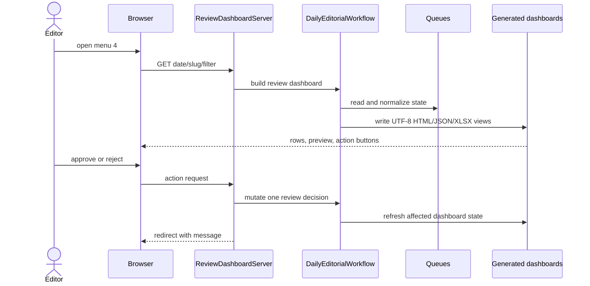

# Dashboard Architecture

The dashboard is a generated operator view over dated topics, review queues, normalized publish state, output paths, Git state, and live checks.

Primary outputs include `upload/<date>/review_dashboard.html`, `data/editorial_operations_console.html`, `data/daily_ceo_dashboard.html`, JSON/CSV companions, and `data/master_dashboard.xlsx`. Live status is generated separately and linked/opened by menu 6 or 7.

Display dimensions remain separate: editorial state, final publish gate, deployment/live state, active blockers, warnings, pending reviews, and historical warnings. Labels are `Human Approved`, `Publish Blocked`, `Ready for Publish`, `Published`, and `Live 200`. Published rows must not display legacy source/AI/approval failures as active diagnostics.

Buttons are generated from known paths/actions: draft, HTML, review, AI report, source review, folder, live preview, URL copy, approve, and reject where valid. Dashboard HTML is not a state source and must not be edited manually. Refresh through `status`, `check-live`, `serve`, or the relevant workflow action.

Current limitation: multiple generated reports can be stale relative to one another until a refresh completes; consumers should use normalized queue state rather than scrape labels.
