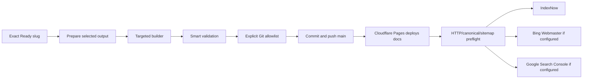

# Deployment

The active production publish root is `docs/`, deployed by Cloudflare Pages Git integration after a push to `origin/main`. `site_output/` is the local build mirror. `netlify.toml` remains compatibility/legacy configuration; Netlify credits are not required by this active path.

The selected build writes matching article copies under `data/published_static_pages/<slug>`, `site_output/<slug>`, `docs/<slug>`, and `upload/<date>/published/<slug>`, synchronizes required assets, and regenerates sitemap data. The staging planner includes only selected-slug files and required shared files; it rejects unrelated slugs and an entire upload date directory.

`.github/workflows/post-deploy-indexing.yml` runs for relevant pushes, derives changed URLs, and invokes `scripts/post_deploy_indexing.py --from-git --preflight-mode targeted_publish_preflight`. Targeted mode checks only selected live URLs, canonical values, sitemap membership, required local/docs output, and HTTP 200. `strict_full_site_audit` checks the whole site and still reports historical defects.

IndexNow submits selected URLs when its key is available. Missing Google or Bing credentials are recorded as `skipped_credentials_missing`, not preflight failure. Non-strict indexing never converts a successful deployment into a failed publish. Reports/logs are written under indexing log/report paths and uploaded as workflow artifacts.

`run_cloudflare_publish.bat` is a separate full build/deploy helper using `build_site.py` and `scripts/deploy_cloudflare.py`; it is not the normal one-article targeted publish path. Deployment completion is external and eventually consistent, so use `check-live` after push.
