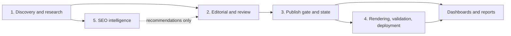

# Five Module Boundaries

These are the current ownership boundaries. The repository has many Python files, but production behavior falls into five collaborating areas.

## 1. Discovery and research

Owned by trend/planning/research/source modules including `ai_trend_discovery`, `content_planning_engine`, `research_intelligence`, `source_connectors`, `verified_source_acquisition`, and `knowledge_registry`. It writes topic, research, enrichment, registry, and knowledge artifacts. It does not grant human approval or publish.

## 2. Editorial and review

Owned by `daily_editorial_workflow`, `content_review`, `human_approval`, `source_review`, `review_dashboard_server`, and article generation modules. It creates drafts and review decisions. Approval is evidence consumed by the gate, not permission to bypass it.

## 3. Publish gate and state

Owned by `publish_gate`, queue normalization in `daily_editorial_workflow`, `publish_lock`, and `editorial_state_reset`. It separates active hard blockers, warnings, pending reviews, historical warnings, normalized state, and deployment state. Only exactly `Ready for Publish` is a publish candidate.

## 4. Rendering, validation, deployment, indexing

Owned by `scripts/build_selected_output.py`, `build_site.py`, validation scripts, sitemap/indexing modules, `scripts/post_deploy_indexing.py`, and deployment workflow files. Targeted builds receive explicit slugs. Full builds/audits remain separate. Cloudflare deploys `docs/`; indexing cannot approve or publish an article.

## 5. SEO intelligence

Owned by `seo_console.py` and `modules/seo_engine/`. It imports keywords, builds clusters, identifies gaps, plans links, and ranks opportunities. Its queue commands are dry-run previews. It must not mutate human approval, publish queue, published output, or Git state.

## Cross-boundary rules

- `DailyEditorialWorkflow` is the application-level coordinator; domain modules retain their own decisions.
- Queue JSON contracts and normalized labels are shared interfaces.
- Dashboard code reads normalized state; it must not infer approval from display text.
- Builders and Git staging accept selected slugs and reject unrelated paths.
- Deployment/indexing consumes validated published URLs and never weakens a publish gate.
- Reset archives stale unpublished state but protects published/live/current/SEO-selected records.

Safe extensions add adapters behind these interfaces. Moving ownership or introducing direct writes across a boundary requires an explicit architecture checkpoint.
