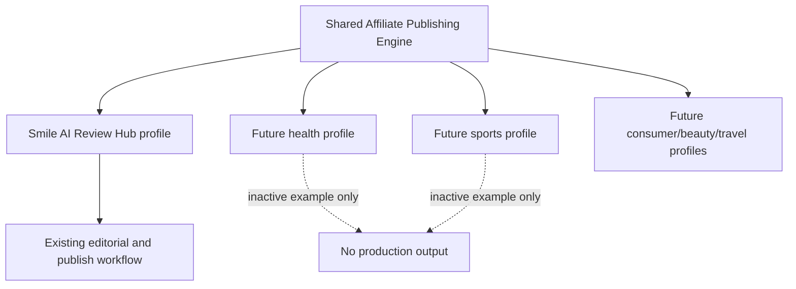
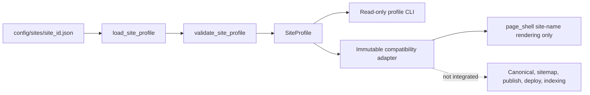
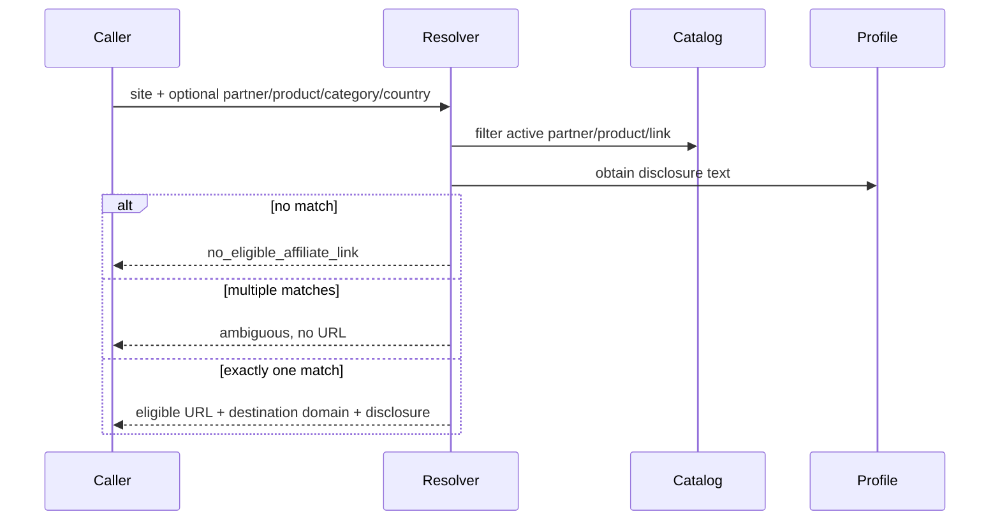

# Multi-Site Affiliate Engine Foundation

## Current implementation

This document describes the foundation implemented in the current repository. It does not describe a completed multi-site publishing system.

The repository still runs Smile AI Review Hub through the existing settings, editorial queues, renderers, menus, publish gate, `docs/` output, GitHub push, Cloudflare Pages deployment, and indexing workflow. `config.py` remains the production authority, and no second site can build, publish, deploy, or submit indexing.

## Completed foundation components

The platform layer adds:

- validated repository-local site profiles;
- one production-compatible Smile AI Review Hub profile;
- two inactive example profiles;
- validated affiliate partner, product, and link contracts;
- a fail-closed affiliate-link resolver;
- read-only profile inspection and config-drift diagnostics.

The Health and Sports profiles are configuration examples only. They are inactive, use reserved domains, and are not production-ready.

## Read-only compatibility scope

The platform layer now has one bounded renderer integration: `modules/site_builder.py::page_shell`
resolves only `site_name` through an immutable compatibility adapter. The adapter keeps
`config.py` authoritative and has byte-for-byte parity coverage. It is not connected to
CTA insertion, canonical routing, sitemap generation, menu publication, deployment, or
indexing.

## Goal

The target direction is one reusable Affiliate Publishing Engine with explicit site-level configuration:



This checkpoint establishes configuration and validation boundaries. It does not clone the repository, introduce a multi-tenant database, or create production sites for additional niches.

## Current state audit

The current application has shared settings in `config.py`, but many modules still contain Smile AI-specific fallbacks or literals:

- `smileaireviewhub.com` and the brand name appear in content, canonical, structured-data, social, audit, and indexing modules;
- `site_output/`, `docs/`, and `data/published_static_pages/` are assumed by build and publish paths;
- AI/SaaS wording appears in content templates and social visuals;
- affiliate information is distributed across `data/affiliate_links.csv`, `data/user_offers.csv`, `modules/offer_loader.py`, `modules/affiliate_links.py`, and partner-intake workflow fields;
- historical offer seeds can identify an affiliate-program page as `affiliate_url`, which is not proof of an operator-specific tracking link;
- the current CSV link system supports official-only and pending records and is used by existing production code.

Those production paths are intentionally unchanged. Bulk replacement would affect canonical URLs, rendering, staging, deployment, and live history.

## Engine and profile boundary

`modules/platform/site_profile.py` owns profile loading and validation. It has no network client and no state writer.



Public interfaces:

- `load_site_profile(site_id=None)`: loads an exact profile; omission selects only the explicit `smile_ai_review_hub` default.
- `get_active_site_profile(site_id=None)`: also requires `active=true`.
- `validate_site_profile(profile, for_production=False)`: validates raw data and optionally applies production safety rules.
- `list_site_profiles()`: lists configured JSON profile IDs.

There is no fallback from a missing requested profile to the default. Profile IDs are restricted to lowercase letters, numbers, and underscores to prevent path traversal.

## Profile contract

Profiles are JSON because the standard library already supports it and the repository does not need another configuration dependency.

Required fields:

- `schema_version`
- `site_id`
- `site_name`
- `brand_name`
- `domain`
- `default_language`
- `supported_languages`
- `niche`
- `categories`
- `content_types`
- `affiliate_disclosure`
- `editorial_settings`
- `seo_defaults`
- `social_platform_settings`
- `source_policy`
- `output`
- `active`
- `production_enabled`
- `example`

Required nested safety values include:

- `editorial_settings.human_approval_required`
- `seo_defaults.canonical_base_url`
- `social_platform_settings.manual_publish_only`
- `source_policy.minimum_usable_sources`
- repository-relative `site_output_dir`, `production_output_dir`, and `published_static_pages_dir`

Secret-like keys such as API keys, tokens, passwords, and secrets are rejected.

## Configured profiles

| Profile | Status | Production |
|---|---|---|
| `smile_ai_review_hub` | active | enabled; current domain and output paths |
| `example_health` | inactive example | blocked |
| `example_sports` | inactive example | blocked |

Example profiles use reserved `.invalid` domains, `noindex,nofollow`, separate namespaces, and `production_enabled=false`. Production validation rejects an inactive, disabled, example, reserved-domain, auto-approval, or auto-social-publish profile.

## Affiliate data ownership

The new per-site contract lives under:

```text
data/sites/<site_id>/affiliate/
    partners.json
    products.json
    links.json
```

For Smile AI Review Hub these files are intentionally empty. Existing CSV values are not silently migrated because a program-information URL is not necessarily a real affiliate tracking URL.

### Partner record

A partner record stores:

- partner and company identity;
- owning site and category;
- program name and verified affiliate URL;
- destination domain and supported countries;
- commission/cookie notes;
- disclosure requirement;
- status, verification date, and operator notes.

An active partner must have a valid HTTPS affiliate URL.

### Product record

A product record stores:

- product and partner identity;
- product name and category;
- destination and optional affiliate URL;
- coupon, price, currency, and availability notes;
- status and verification date.

An active product must have a valid HTTPS destination URL. Its destination host must match the owning partner's destination domain or a subdomain of it.

### Link record

A link is the independently selectable affiliate destination. It stores:

- link, site, partner, and optional product identity;
- category;
- affiliate and destination URLs;
- destination domain;
- supported countries;
- disclosure requirement;
- status, verification date, and operator notes.

An active link requires both URLs. The destination URL host must match `destination_domain`. A tracking affiliate URL may use another host because affiliate networks commonly redirect through their own domains.

## Affiliate link resolution

`modules/platform/affiliate_resolver.py` resolves against already-validated records:



The resolver does not construct URLs, choose inactive records, or guess between multiple matches. No production renderer calls it in this checkpoint.

## Backward compatibility

The default profile preserves:

- domain `https://smileaireviewhub.com`;
- English default and English/Vietnamese support;
- human approval and publish-gate requirements;
- manual-only social publication;
- minimum two usable sources;
- `site_output/`, `docs/`, and `data/published_static_pages/`.

Backward compatibility remains a legacy-authority model rather than a runtime takeover:

- existing `config.py` remains the production settings provider;
- `SiteRuntimeConfig` returns effective legacy values and uses the profile only as compatibility evidence;
- `page_shell` reads only its displayed site name through that immutable context;
- matching-profile tests prove the adapter-backed HTML is byte-identical to the legacy HTML;
- mismatch, missing, inactive, and example profiles fall back to legacy values in normal mode and fail closed in strict mode;
- Menu 1-16 behavior is unchanged;
- existing CSV affiliate loaders and generated `/go/` pages are unchanged;
- no queue, state, article, sitemap, output, deployment, or indexing file is migrated;
- read-only scripts are the only current entry points to the new layer.

## Read-only commands

```powershell
python scripts/validate_site_profiles.py
python scripts/validate_site_profiles.py --production-check
python scripts/show_site_profile.py --site smile_ai_review_hub
python scripts/show_site_profile.py --site smile_ai_review_hub --production-check
python scripts/show_site_runtime_config.py --site smile_ai_review_hub
python scripts/show_site_runtime_config.py --site smile_ai_review_hub --strict
```

These commands load local JSON, print validation results, and return a nonzero exit code on failure. They do not build, write state, publish, call an API, or use the network.

## No-paid-API boundary

The foundation uses `json`, `pathlib`, `dataclasses`, `re`, and `urllib.parse` from the Python standard library. It adds:

- no API key;
- no paid API;
- no required network service;
- no telemetry;
- no repository data export.

Future paid-provider integrations are out of scope and must remain optional and disabled unless separately approved.

## Implementation status

| Milestone | Status | Current scope |
|---|---|---|
| Validated site-profile and affiliate foundation | **COMPLETED** | Local profile schema/loaders, inactive examples, per-site affiliate catalogs, and fail-closed resolver |
| Read-only diagnostics | **COMPLETED** | Profile inspection, validation, runtime comparison, and config-drift analysis |
| Immutable compatibility runtime adapter | **COMPLETED** | Legacy values remain authoritative; incompatible or inactive profiles fall back or fail closed according to mode |
| Single renderer-field integration | **COMPLETED** | Only `modules/site_builder.py::page_shell` obtains displayed `site_name` through the adapter, with byte-equivalent regression coverage |
| Production multi-site routing | **NOT IMPLEMENTED** | No profile-owned queue, output, staging, publish, or site-selection routing |
| Affiliate CTA integration | **NOT IMPLEMENTED** | The resolver is not called by production CTA rendering |
| Canonical and sitemap profile migration | **NOT IMPLEMENTED** | Existing production authority and generation paths remain unchanged |
| Social profile integration | **NOT IMPLEMENTED** | Social generation still uses the existing Smile AI-specific workflow |
| Deployment and indexing isolation | **NOT IMPLEMENTED** | No per-site deployment target, branch, output root, or indexing ownership |

Completed foundation milestones do not make the renderer, publish workflow, or repository production-multi-site capable.

## Not implemented

The following capabilities remain outside the current implementation:

- profile authority over canonical URLs, sitemap generation, social output, dashboards, or menus;
- production CTA selection through the affiliate resolver;
- per-site editorial queue, article state, output namespace, or staging allowlist ownership;
- per-site publish, Git, deployment, Cloudflare Pages, or indexing isolation;
- production activation of the Health or Sports examples;
- building, publishing, deploying, or indexing any second site.

## Migration gates

Future work must pass separately reviewed gates in this order:

1. Classify and verify operator-owned affiliate links separately from official or affiliate-program information pages.
2. Preview any legacy affiliate conversion without changing production CTA behavior.
3. Migrate one additional field or component only after compatibility, no-mutation, and output-parity tests pass.
4. Define explicit per-site queue ownership, output roots, staging allowlists, canonical and sitemap ownership, deployment targets, and indexing isolation.
5. Approve a second production site only after legal, disclosure, source, rendering, publish, deployment, and rollback requirements are independently validated.

No future gate in this list is represented as completed.

## Adding a new niche example

1. Copy an example profile.
2. Assign a unique `site_id` and reserved `.invalid` domain.
3. Keep `active=false`, `production_enabled=false`, and `example=true`.
4. Set niche, categories, content types, disclosure, source policy, and namespaced output paths.
5. Run profile validation and tests.

This demonstrates configuration coverage only; it does not create or publish a site.

## Adding a production website

This is not yet an operator command. A future production profile requires:

1. a real owned domain and legal/disclosure review;
2. explicit human-approval and manual-social-publish safeguards;
3. independent output namespace and static-root design;
4. verified affiliate data owned by that site;
5. renderer, canonical, sitemap, schema, staging, deployment, and indexing tests;
6. a migration checkpoint proving the default Smile AI output is unchanged;
7. explicit activation only after deployment configuration is reviewed.

Changing an example profile to active is insufficient.

## Risks and limitations

- Hard-coded Smile AI assumptions still exist in production modules.
- `config.py` and environment variables remain authoritative for the current site.
- Only the `site_name` reads inside `page_shell` use `SiteRuntimeConfig`; this is not full renderer migration.
- Legacy affiliate CSVs are not represented in the new catalog.
- No production CTA consumes the resolver.
- There is no cross-site queue namespace, deployment router, dashboard selector, or sitemap coordinator.
- Multiple domains sharing one repository would increase staging and deployment-isolation risk.
- Health content requires stronger legal, medical-source, and safety policy work before any production use.
- Country eligibility is a repository record maintained by the operator, not a real-time availability service.
- URL validation is syntactic and domain-consistency validation; it does not make network requests.

## Files that must not be edited to force behavior

Do not manually alter queues, article state, publish reports, generated dashboards, generated article HTML, sitemap output, or live history to simulate a profile migration. Profile/catalog source files must be changed deliberately and validated; production integration must occur in code with tests.

## Safe next extension

The read-only compatibility report now exists in `modules/platform/config_drift.py` with the CLI:

```powershell
python scripts/report_site_profile_drift.py --site smile_ai_review_hub
python scripts/report_site_profile_drift.py --site smile_ai_review_hub --json
python scripts/report_site_profile_drift.py --site smile_ai_review_hub --strict
python scripts/report_site_profile_drift.py --site smile_ai_review_hub --output data/local-profile-drift.txt
```

Without `--output`, the command writes no file. It reads only allowlisted public environment overrides and reports secret configuration as `PRESENT`, `ABSENT`, or `OVERRIDE_PRESENT`. Normal mode returns success when analysis completes even if drift exists. Strict mode returns nonzero when it detects a production-critical hardcode or an unsafe migration boundary.

The report distinguishes field comparison, bounded source-code hardcodes, actual integration status, and migration readiness. It reports the renderer as `READ_ONLY_ADAPTER_INTEGRATED` only for `page_shell.site_name`. Canonical, sitemap, social, affiliate resolver, publish, deployment, indexing, and dashboard/menu integration remain incomplete. The profile still does not control production behavior.

`modules/platform/site_runtime_config.py` is frozen and read-only. Its public factory is:

```python
build_site_runtime_config(
    site_id="smile_ai_review_hub",
    strict_profile_match=False,
)
```

Normal mode uses `FALLBACK_TO_LEGACY` for missing or incompatible profile data. Strict
mode raises before rendering. The adapter reads no secret, performs no network request,
and writes no report or state. The next migration must remain a separately reviewed,
single-component checkpoint; output roots, queue ownership, staging, deployment, and
indexing are still blocked from profile integration.
