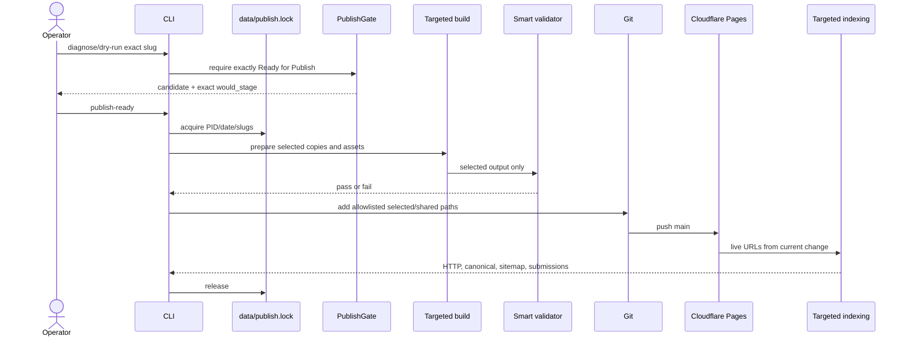

# Publish Workflow

The current publish chain is `AI Review -> Human Approval -> Publish Validation -> Ready for Publish -> Published -> Live 200`.

Human approval records an editor decision. `PublishGate.normalize_existing_row()` then calculates active hard blockers, warnings, pending reviews, historical warnings, normalized status, and final gate. Published is terminal for active diagnostics.

Dry-run is non-mutating. Real publish stops on gate, validation, Git, permission, or push errors. The expected no-ready condition is friendly/non-crashing in the menu. Stage planning never accepts a whole `upload/<date>` directory and asserts that unrelated slugs are absent.

Targeted build writes the selected article to `data/published_static_pages/<slug>/index.html`, `site_output/<slug>/index.html`, `docs/<slug>/index.html`, and `upload/<date>/published/<slug>/index.html`, plus required shared assets/sitemaps/reports. State becomes Published only through the successful workflow. Post-deploy indexing does not roll back a successful deployment.
