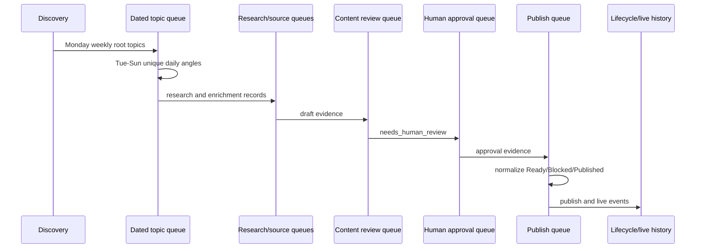

# Queue Architecture

Queue files are workflow-owned JSON/CSV/Markdown artifacts under `data/` and dated `data/editorial_queue/<date>/`. They are not manual control files.

Key stores include `content_review_queue.json`, `human_approval_queue.json`, `source_review_queue.json`, `research_enrichment_queue.json`, `publish_queue.json`, dated `topics.json`, lifecycle JSONL, and live URL history. Reports mirror queue state for operators but are not the source of decisions.

Lifecycle rules:

- Monday discovery creates `data/editorial_queue/weeks/<week_start>/week.json` and the Monday dated queue. Each active root stores immutable identity plus append-only `daily_angles` history.
- Tuesday-Sunday `daily-followup` reads that weekly manifest without discovery and creates at most one source-ready angle per root in `data/editorial_queue/<date>/topics.json`.
- A repeated Menu 2 run returns the existing dated queue without overwriting it. A legacy queue missing `root_topic_id` or `daily_angle` is held for manual review.
- Draft/research adds evidence and review artifacts.
- AI review may pass or require work.
- Human approval changes only human review state.
- Publish gate derives `approved_for_publish`, `blocked`, `needs_human_review`, or published state.
- Publication appends history and updates selected records.
- Historical warnings remain audit data but are not active blockers for Published rows.

`reset-unpublished` is dry-run by default. It protects published/live records, current active batch, selected SEO work, docs/site output, published static pages, sitemap, and live history. Apply mode archives eligible old unpublished records under `data/archive/unpublished_reset/<timestamp>/` before pruning them and refreshing dashboards.

Safe extensions preserve JSON fields and audit history, use atomic workflow helpers where present, and never edit queue files to force state transitions. The publish lock serializes publishing; other queue writers are not globally transactional, which remains technical debt.
