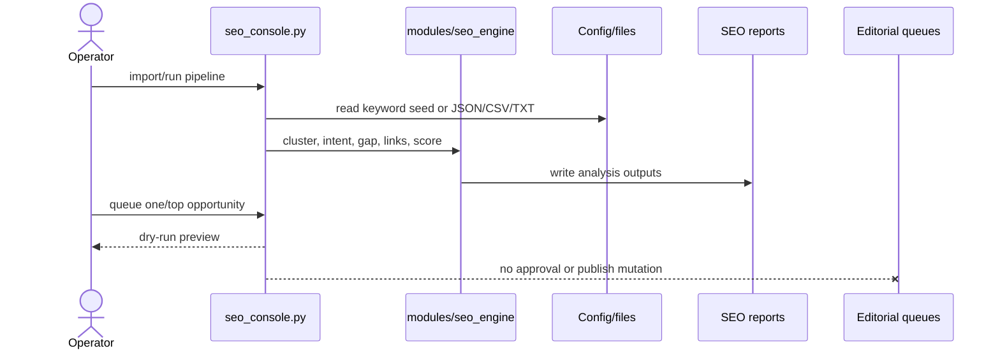

# SEO Engine Boundary

The SEO Engine is an offline opportunity-research subsystem, entered through menu 12 or `seo_console.py`.

## Current submenu

1. Import keywords.
2. Build clusters.
3. Analyze content gaps.
4. Plan internal links.
5. Rank opportunities.
6. Run the complete SEO pipeline.
7. Show/open report.
8. Preview one opportunity (`queue-opportunity`, dry-run).
9. Preview the top opportunity (`queue-top --count 1`, dry-run).
10. Return to the main menu.

The engine owns keyword research, clustering, search intent, content-gap analysis, internal-link planning, opportunity scoring, and its reports. It may read site/editorial information for analysis. It does not own drafts, AI review, source approval, human approval, publish-gate thresholds, article state, static output, Git staging, deployment, or indexing.

Safe extension points are new analyzers and report fields under `modules/seo_engine/`, provided queue and publish files remain read-only. Operator-selected SEO work is protected by stale-unpublished reset. Generated SEO reports should be regenerated through the CLI rather than edited manually.
