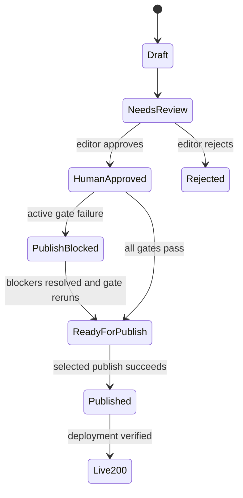

# State Machine

The implementation exposes three related state dimensions. They must not be collapsed into one label.

Editorial labels include Draft, Needs Review, Human Approved, and Rejected. Publish-gate labels include Human Approval Required, Publish Blocked, Ready for Publish, and Published. Deployment labels include Awaiting Publish, Missing Local Output, Docs Pending, Awaiting Push, Live 200, and unexpected Live 404 for an article already published.

Only normalized status `approved_for_publish` with final gate `Ready for Publish`, human approval present, no hard blockers, not already published/live, matching batch date, and required HTML signals can be selected. Dry-run rejects every other or unknown state without mutation.

Active hard blockers prevent publication. Warnings are non-terminal diagnostics. Pending reviews identify missing review steps. Historical warnings/audit history are retained evidence and do not reactivate blockers for Published rows. Published is the final workflow state; live status reports deployment outcome without reverting editorial history.

State changes must go through workflow commands or dashboard actions. Never manually edit queue JSON, batch topic state, generated dashboard labels, or published output to simulate a transition.
